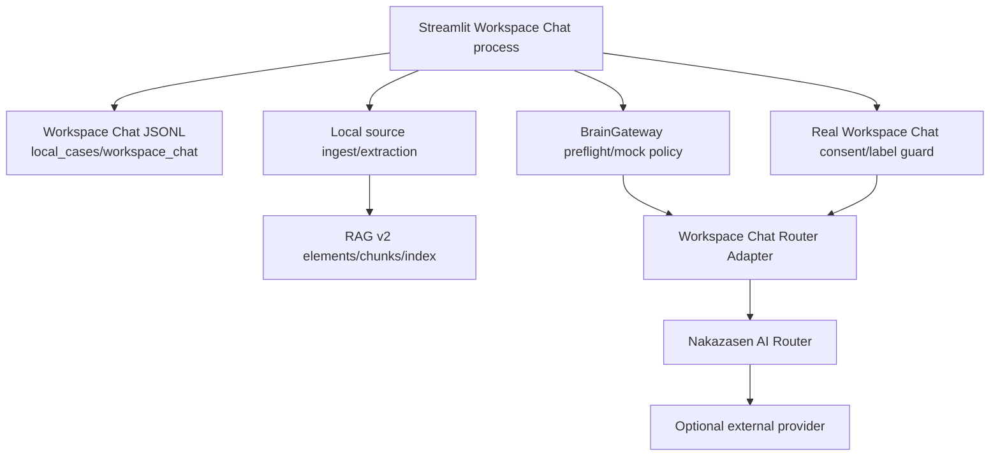

# Architecture Containers

Status: `ACTIVE`
Owner role: Project owner / architecture reviewer
Last reviewed: 2026-07-25
Review cadence: Before adding a process, durable store or provider boundary

The two route shapes are a documented P0 convergence gap: the Gateway path
includes sanitized payload policy, while the current real provider path has its
own label/consent guard. See [ADR-0004](../adr/0004-brain-gateway-privacy-ownership.md).

| Container | Responsibility | Persistent data | Boundary |
|---|---|---|---|
| Workspace Chat | Owner interaction, local notebook/conversation lifecycle | Ignored JSONL | Supported UI |
| Ingest/retrieval | Extract source bytes and build local evidence/retrieval views | Caller/feature-selected local data | Local default |
| RAG v2 index | Chunk storage and deterministic lexical search | Caller-selected SQLite path | Local only |
| Brain Gateway | Privacy labels, consent and sanitized route eligibility | Request-scoped contract | Policy authority |
| Router adapter/router | Provider request/outcome integration | Environment keys only at execution | Optional external boundary |

## Failure posture

Local work remains available when a provider is disabled/unavailable. Provider
failure returns a safe user message; it is not evidence that local data was
transmitted or lost.

## Related records

- [Components](COMPONENTS.md)
- [Cloud preflight sequence](sequences/CLOUD_PREFLIGHT.md)
- [Runtime interfaces](../contracts/RUNTIME_INTERFACES.md)
