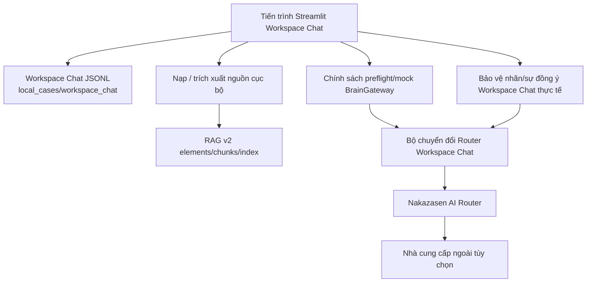

# Các Container Kiến trúc (Architecture Containers)

Status: `ACTIVE`
Owner role: Project owner / architecture reviewer
Last reviewed: 2026-07-25
Review cadence: Before adding a process, durable store or provider boundary

Hai hình thái tuyến ở trên là một khoảng cách hội tụ P0 đã được ghi nhận: tuyến Gateway bao gồm chính sách payload đã làm sạch, trong khi tuyến provider thực tế hiện tại có chốt chặn nhãn/sự đồng ý riêng. Xem [ADR-0004](../adr/0004-brain-gateway-privacy-ownership.md).

| Container | Trách nhiệm | Dữ liệu bền vững | Ranh giới |
|---|---|---|---|
| Workspace Chat | Tương tác của chủ sở hữu, vòng đời sổ ghi chép/cuộc trò chuyện cục bộ | JSONL (được gitignore) | Giao diện hỗ trợ |
| Nạp/truy xuất (Ingest/retrieval) | Trích xuất byte nguồn và xây dựng các khung nhìn bằng chứng/truy xuất cục bộ | Dữ liệu cục bộ do caller/tính năng chọn | Mặc định cục bộ |
| Chỉ mục RAG v2 | Lưu trữ chunk và tìm kiếm từ vựng (lexical) tất định | Đường dẫn SQLite do caller chọn | Chỉ cục bộ |
| Brain Gateway | Nhãn bảo mật, sự đồng ý (consent) và tính hợp lệ của tuyến làm sạch | Hợp đồng phạm vi theo request | Thẩm quyền chính sách |
| Router adapter / Router | Tích hợp yêu cầu/kết quả từ nhà cung cấp | Key môi trường chỉ đọc tại thời điểm thực thi | Ranh giới ngoài tùy chọn |

## Tư thế Ứng phó Sự cố (Failure Posture)

Công việc cục bộ vẫn khả dụng bình thường khi provider bị vô hiệu hóa hoặc không thể truy cập. Lỗi từ phía provider sẽ trả về thông điệp an toàn cho người dùng; đó không phải là bằng chứng cho thấy dữ liệu cục bộ bị truyền đi hoặc bị mất mát.

## Các Bản ghi Liên quan (Related Records)

- [Các thành phần kiến trúc (Components)](COMPONENTS.md)
- [Trình tự kiểm tra trước đám mây (Cloud preflight sequence)](sequences/CLOUD_PREFLIGHT.md)
- [Hợp đồng giao diện runtime (Runtime interfaces)](../contracts/RUNTIME_INTERFACES.md)

