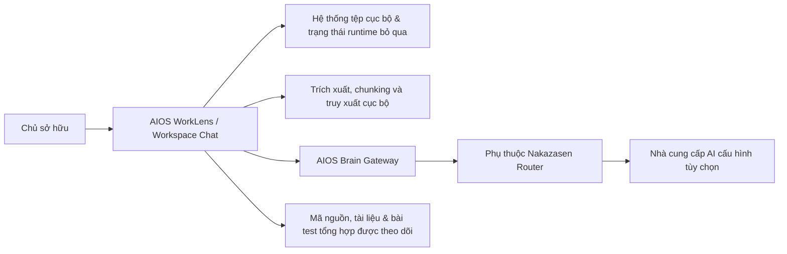

# Bối cảnh Kiến trúc (Architecture Context)

Status: `ACTIVE`
Owner role: Project owner / architecture reviewer
Last reviewed: 2026-07-25
Review cadence: Before adding a user role, external system or data boundary

## Mục đích Hệ thống (System Purpose)

AIOS WorkLens là một môi trường tri thức công việc ưu tiên cục bộ (local-first). Chủ sở hữu chọn các nguồn dữ liệu cục bộ, đặt câu hỏi tự nhiên qua Workspace Chat và kiểm tra bằng chứng/ngữ cảnh nguồn trước khi chấp nhận câu trả lời.

## Các Hệ thống Bên ngoài (External Systems)

| Hệ thống | Chiều tương tác | Ranh giới |
|---|---|---|
| Hệ thống tệp chủ sở hữu | Đọc/ghi trạng thái cục bộ | Chủ sở hữu kiểm soát quyền truy cập và sao lưu |
| Nhà cung cấp AI tùy chọn | Chỉ gửi ra ngoài sau khi chính sách cho phép | Provider không phải là bộ lưu trữ mặc định/cục bộ |
| Git hosting / CI | Chỉ mã nguồn / kiểm thử / tài liệu | Tuyệt đối không chứa dữ liệu runtime riêng tư hoặc thông tin xác thực |

## Các Mục tiêu Nằm ngoài Phạm vi (Non-goals)

Khung nhìn bối cảnh này không ngụ ý bất kỳ tính năng đồng bộ đám mây (cloud synchronization), tuyến provider bắt buộc, cơ sở dữ liệu vector hoặc dịch vụ đa người thuê (multi-tenant) nào.

## Các Bản ghi Liên quan (Related Records)

- [Kiến trúc logic (Logical architecture)](../../ARCHITECTURE.md)
- [Các container kiến trúc (Containers)](CONTAINERS.md)
- [Mô hình mối đe dọa (Threat model)](../security/THREAT_MODEL.md)

