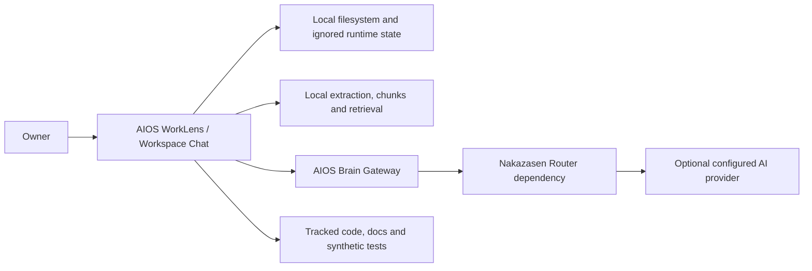

# Architecture Context

Status: `ACTIVE`
Owner role: Project owner / architecture reviewer
Last reviewed: 2026-07-25
Review cadence: Before adding a user role, external system or data boundary

## System purpose

AIOS WorkLens is a local-first work-knowledge environment. The owner selects
local sources, asks naturally through Workspace Chat and checks evidence/context
before accepting an answer.

## External systems

| System | Direction | Boundary |
|---|---|---|
| Owner filesystem | Read/write local state | Owner controls access and backup |
| Optional AI provider | Outbound only after policy allows | Provider is not default/local storage |
| Git hosting/CI | Source/tests/docs only | No private runtime data or credentials |

## Non-goals

No cloud synchronization, mandatory provider route, vector database or
multi-tenant service is implied by this context view.

## Related records

- [Logical architecture](../../ARCHITECTURE.md)
- [Containers](CONTAINERS.md)
- [Threat model](../security/THREAT_MODEL.md)
