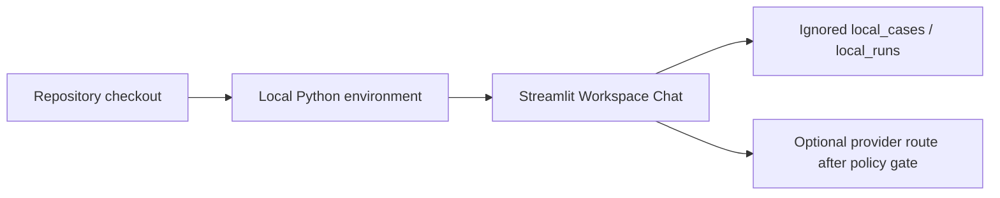

# Deployment and Runtime View

Status: `PARTIAL`
Owner role: Project owner / release reviewer
Last reviewed: 2026-07-25
Review cadence: Before changing distribution, supported OS/Python or service topology

## Current supported deployment shape

AIOS WorkLens currently runs as a local Python/Streamlit application launched
from a repository checkout. `pyproject.toml` requires Python 3.11 or later and
the supported UI launcher starts Workspace Chat locally.

## Verified constraints

- No server deployment, multi-user hosting, container image or package registry
  distribution is currently guaranteed.
- No background service or cloud database is required for local Workspace Chat.
- API keys are supplied through the environment for live router calls; they are
  not tracked configuration.

## Proposed support baseline

Windows 10/11 and Python 3.11–3.13 are proposed for release validation, subject
to owner approval in [supported versions](../release/SUPPORTED_VERSIONS.md).
Other operating systems and automated installers are not current commitments.

## Operational references

- [Install guide](../INSTALL.md)
- [Release policy](../release/RELEASE_POLICY.md)
- [Backup and restore](../operations/BACKUP_RESTORE.md)
