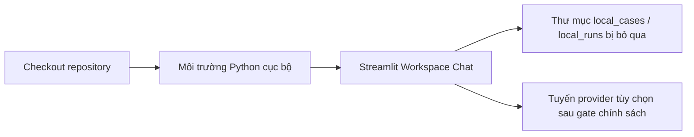

# Khung nhìn Triển khai & Runtime (Deployment and Runtime View)

Status: `PARTIAL`
Owner role: Project owner / release reviewer
Last reviewed: 2026-07-25
Review cadence: Before changing distribution, supported OS/Python or service topology

## Hình thái triển khai được hỗ trợ hiện tại (Current Supported Deployment Shape)

AIOS WorkLens hiện đang chạy dưới dạng một ứng dụng Python/Streamlit cục bộ được khởi chạy từ bản checkout của repository. `pyproject.toml` yêu cầu Python 3.11 trở lên và trình khởi chạy giao diện được hỗ trợ sẽ bật Workspace Chat cục bộ.

## Các Ràng buộc Đã xác minh (Verified Constraints)

- Chưa hỗ trợ triển khai máy chủ phân tán (server deployment), lưu trữ đa người dùng (multi-user hosting), container image hoặc phân phối qua package registry.
- Không yêu cầu bất kỳ dịch vụ nền (background service) hoặc cơ sở dữ liệu đám mây nào để chạy Workspace Chat cục bộ.
- API key được cung cấp thông qua biến môi trường khi thực hiện gọi router trực tiếp; chúng tuyệt đối không nằm trong cấu hình được theo dõi.

## Mức Hỗ trợ Đề xuất Cơ sở (Proposed Support Baseline)

Windows 10/11 và Python 3.11–3.13 được đề xuất cho việc kiểm chứng phát hành, tùy thuộc vào sự phê duyệt của chủ sở hữu trong [các phiên bản được hỗ trợ (supported versions)](../release/SUPPORTED_VERSIONS.md). Các hệ điều hành khác và bộ cài đặt tự động hiện chưa phải là cam kết chính thức.

## Tài liệu Tham khảo Vận hành (Operational References)

- [Hướng dẫn cài đặt (Install guide)](../INSTALL.md)
- [Chính sách phát hành (Release policy)](../release/RELEASE_POLICY.md)
- [Sao lưu và phục hồi (Backup and restore)](../operations/BACKUP_RESTORE.md)

