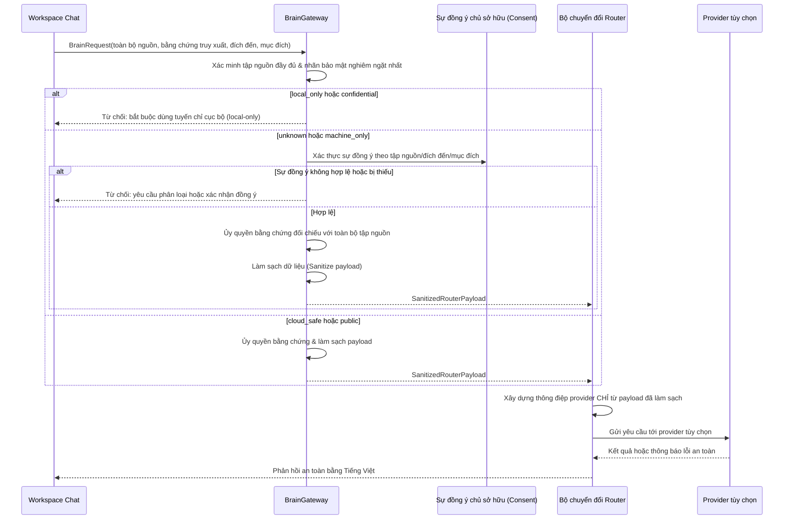

# Trình tự: Kiểm tra Trước khi Gửi Ra Ngoài Workspace Chat (External Preflight)

Status: `ACTIVE`
Owner role: Project owner / privacy reviewer
Last reviewed: 2026-07-25
Review cadence: Before changing labels, consent or external destinations

Trình tự này tài liệu hóa tuyến tùy chọn đã được triển khai; nó không kích hoạt bất kỳ provider nào theo mặc định. Tuyến này luôn bị chặn khi cấu hình router không khả dụng, chính sách từ chối, hoặc truy xuất không mang lại bằng chứng đủ điều kiện.

## Các Bản ghi Liên quan (Related Records)

- [ADR-0004](../../adr/0004-brain-gateway-privacy-ownership.md)
- [Đánh giá tác động quyền riêng tư (Privacy impact assessment)](../../security/PRIVACY_IMPACT_ASSESSMENT.md)

