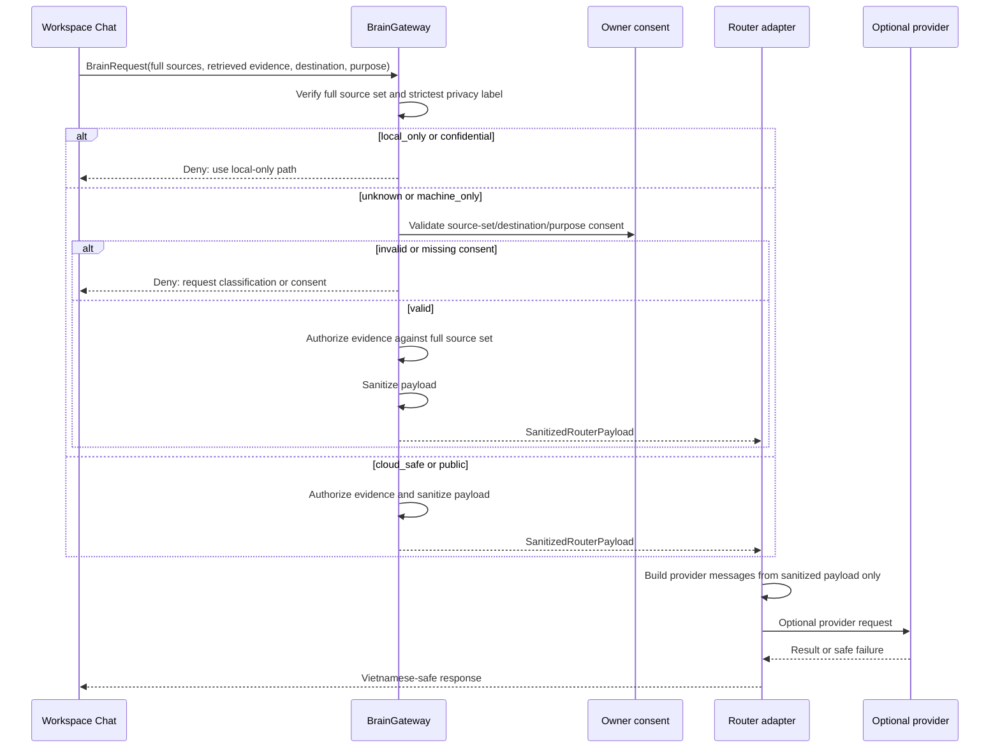

# Sequence: Workspace Chat External Preflight

Status: `ACTIVE`
Owner role: Project owner / privacy reviewer
Last reviewed: 2026-07-25
Review cadence: Before changing labels, consent or external destinations

This sequence documents the implemented optional route; it does not enable any
provider by default. The route remains blocked when router configuration is
unavailable, policy denies, or retrieval yields no eligible evidence.

## Related records

- [ADR-0004](../../adr/0004-brain-gateway-privacy-ownership.md)
- [Privacy impact assessment](../../security/PRIVACY_IMPACT_ASSESSMENT.md)
