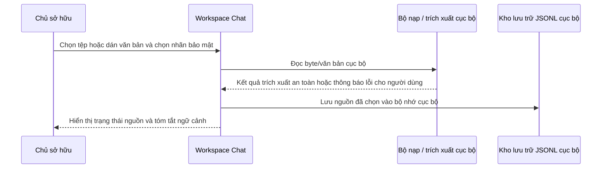

# Trình tự: Nạp Nguồn Dữ liệu Cục bộ (Local Source Ingest)

Status: `ACTIVE`
Owner role: Project owner / architecture reviewer
Last reviewed: 2026-07-25
Review cadence: Before changing upload, extraction or source persistence

Luồng tải lên mặc định luôn xử lý cục bộ. Nhãn bảo mật được chọn/lưu trữ trước khi một nguồn đủ điều kiện đưa vào định tuyến câu trả lời sau này. Các lỗi trích xuất phải được hiển thị dưới dạng thông điệp tiếng Việt thân thiện, không lộ traceback thô.

## Hành vi khi Xảy ra Lỗi (Failure Behavior)

Đầu vào không thể đọc được sẽ được giữ lại dưới dạng lỗi cục bộ kèm thông báo an toàn. Tuyệt đối không kích hoạt fallback gửi lên provider hay tải tệp nguồn lên mạng.

## Các Bản ghi Liên quan (Related Records)

- [Mô hình mối đe dọa (Threat model)](../../security/THREAT_MODEL.md)
- [Hướng dẫn sử dụng (User guide)](../../user/WORKSPACE_CHAT_USER_GUIDE.md)

