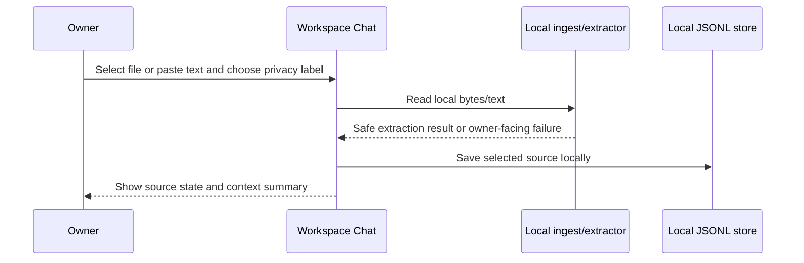

# Sequence: Local Source Ingest

Status: `ACTIVE`
Owner role: Project owner / architecture reviewer
Last reviewed: 2026-07-25
Review cadence: Before changing upload, extraction or source persistence

The upload path is local by default. A privacy label is selected/stored before a
source is eligible for later answer routing. Extraction errors should be shown as
localized owner messages, not raw tracebacks.

## Failure behavior

Unreadable input remains a local failure with a safe message. It does not trigger
provider fallback or source upload.

## Related records

- [Threat model](../../security/THREAT_MODEL.md)
- [User guide](../../user/WORKSPACE_CHAT_USER_GUIDE.md)
