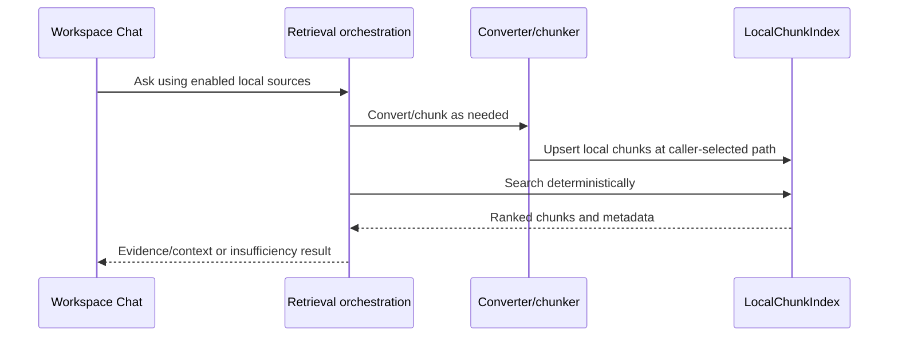

# Sequence: Local Retrieval

Status: `ACTIVE`
Owner role: Project owner / RAG architecture reviewer
Last reviewed: 2026-07-25
Review cadence: Before changing chunking, index storage or ranking behavior

Current RAG v2 foundation is deterministic lexical retrieval. It is local-first,
generic and does not claim vector/semantic search, robust bilingual ranking or
PNG OCR.

## Related records

- [RAG v2 design](../../rag_v2/RAG_V2_DESIGN.md)
- [ADR-0003](../../adr/0003-local-sqlite-lexical-index.md)
- [Performance baseline](../../operations/PERFORMANCE_CAPACITY_BASELINE.md)
