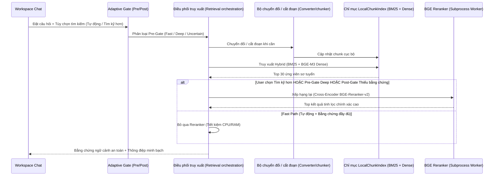

# Trình tự: Truy xuất Cục bộ (Local Retrieval)

Status: `ACTIVE`
Owner role: Project owner / RAG architecture reviewer
Last reviewed: 2026-07-25
Review cadence: Before changing chunking, index storage or ranking behavior

Nền tảng RAG v2 hỗ trợ truy xuất thích ứng 2 tầng (2-Stage Adaptive Reranking) kết hợp BM25 + Dense BGE-M3 và Cross-Encoder BGE-Reranker-v2-M3. Hệ thống có Circuit Breaker tự ngắt sau 3 lỗi liên tiếp và hạ cấp trong suốt về Hybrid khi backend reranker bận/quá tải.

## Các Bản ghi Liên quan (Related Records)

- [Thiết kế RAG v2 (RAG v2 design)](../../rag_v2/RAG_V2_DESIGN.md)
- [ADR-0003](../../adr/0003-local-sqlite-lexical-index.md)
- [Hướng dẫn Vận hành Adaptive Reranking](../../../specs/003-adaptive-reranking-ux/operations-guide.md)
- [Mức hiệu năng cơ sở (Performance baseline)](../../operations/PERFORMANCE_CAPACITY_BASELINE.md)

