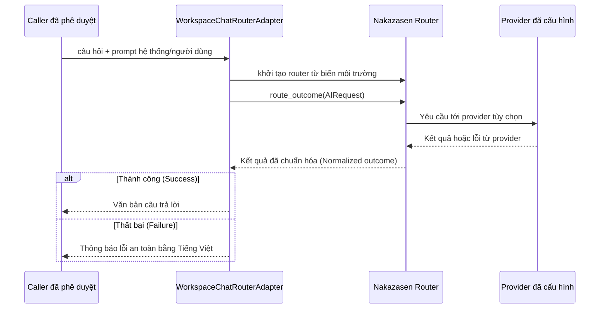

# Trình tự: Gọi Router & Xử lý Lỗi An toàn (Router Call & Safe Failure)

Status: `ACTIVE`
Owner role: Project owner / integration reviewer
Last reviewed: 2026-07-25
Review cadence: Each router/provider upgrade or error-contract change

Key được đọc từ biến môi trường của tiến trình tại thời điểm gọi. Adapter tuyệt đối không được in key, dữ liệu authorization thô hay payload yêu cầu provider ra log. Mọi lỗi từ provider đều được ánh xạ sang thông điệp an toàn cho người dùng.

## Các Bản ghi Liên quan (Related Records)

- [ADR-0005](../../adr/0005-router-provider-routing-boundary.md)
- [Quy trình phản ứng sự cố (Incident response)](../../operations/INCIDENT_RESPONSE.md)

