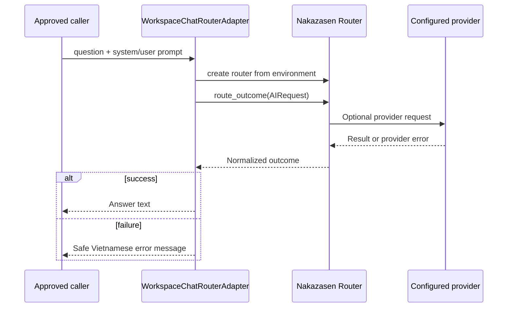

# Sequence: Router Call and Safe Failure

Status: `ACTIVE`
Owner role: Project owner / integration reviewer
Last reviewed: 2026-07-25
Review cadence: Each router/provider upgrade or error-contract change

Keys are read from process environment at call time. The adapter must not print
keys, raw authorization data or provider request payloads. Provider failure is
mapped to a safe user message.

## Related records

- [ADR-0005](../../adr/0005-router-provider-routing-boundary.md)
- [Incident response](../../operations/INCIDENT_RESPONSE.md)
