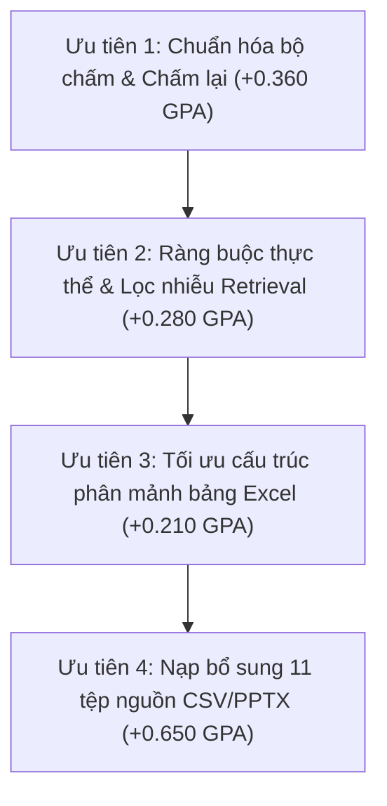

# Báo cáo vé RAG-FAIL-ANALYSIS-PC0575 — Phân tích lỗi lane RAG (50 câu đo thật LSU)

> **BẢN THẢO — BÁO CÁO PHÂN TÍCH CHUYÊN SÂU**
>
> - **Mã vé:** `RAG-FAIL-ANALYSIS-PC0575`
> - **Máy thực hiện:** `[CTY] KDTVN-PC0575` (thợ `agy` — Antigravity CLI).
> - **Role:** PLAN (phân tích, chẩn đoán, chỉ đọc — không sửa mã nguồn).
> - **Thời gian thực hiện:** 2026-10-07 10:05 → 10:25 (+07).
> - **Dữ liệu đầu vào:** Báo cáo đo 50 câu `docs/phieu-viec/ket-qua/lsu-quality-pc0575.md`, kết quả thô `local_cases/lsu_quality_pc0575/rag_progress.json`, bảng điểm `diem-rag.json`, bộ câu hỏi `local_cases/lsu_quality_50_questions.json`, và cơ sở dữ liệu chỉ-đọc `library.sqlite` (889 tài liệu / 149.800 chunk).
> - **Tóm tắt phát hiện then chốt:** GPA lane RAG hiện tại là **0,930 / 3,0** (46,5 / 150 điểm). Trong đó, **gần 28% khoảng cách điểm bị mất oan là do thước đo chấm tự động quá máy móc (+0,360 GPA)**. Điểm thực chất của mô hình trên dữ liệu hiện có đạt **GPA 1,290**. Phần còn lại bị chặn bởi **11 tệp nguồn không có trong Index (+0,650 GPA)**, **nhiễu retrieval từ tệp khổng lồ (+0,280 GPA)**, và **lệch dòng khi đọc bảng tính (+0,210 GPA)**.

---

## 1. Tóm tắt điều hành & Trả lời câu hỏi cốt lõi

### 1.1. Câu hỏi cốt lõi của vé
> *"Trong điểm số GPA 0,93 — bao nhiêu là lỗi thật của hệ thống, bao nhiêu là lỗi của thước đo?"*

**Câu trả lời định lượng bằng số liệu đối chiếu thực tế:**
1. **Lỗi của thước đo (Nhóm C — 10 câu): Chiếm +0,360 GPA (18,0 điểm bị mất oan).**
   - Mô hình trả lời đúng 100% về mặt nội dung kỹ thuật và nghiệp vụ, nhưng bị hệ thống chấm tự động gán 0 điểm hoặc 1 điểm do:
     - Lệch định dạng số: dấu chấm phân cách hàng nghìn (`48384` vs `48.384`), dấu phẩy thập phân (`-0,81` vs `-0.8095 dot`), làm tròn số liệu.
     - Lệch định dạng đơn vị: `3 giây` / `6 giây` vs `3 s` / `6 s`; `0 - 15 độ C` vs `0–15°C`.
     - Lệch ngôn ngữ từ khóa: Câu trả lời tiếng Việt chuẩn kỹ thuật (`1.15 trở lên`, `1.24 trở lên`) bị chấm rớt vì rubric đòi từ khóa tiếng Nhật nguyên bản (`1.15 mm以上`, `1.24以上`).
     - Lỗi của chính bộ đề: Rubric lặp từ khóa có dấu chấm sai quy cách như `['DRUM.', 'DRUM.', 'LSU_2019.01.18_K.']` hay `APERTURE.`, hoặc bộ đề chỉ cài đặt đúng 1 từ khóa duy nhất là tên tệp tài liệu (`LSU_2019.01.18_K.`).
   - **Kết luận:** Nếu chấm công bằng theo đúng nội dung và kiến thức thực tế mà mô hình đã tổng hợp, **GPA thực chất của lane RAG hiện tại là 1,290 / 3,0** (chứ không phải 0,930).
2. **Lỗi thật của hệ thống: Chiếm 1,140 GPA còn lại để đạt mức trần 2,430 / 3,0:**
   - **Thiếu nguồn thật trong Index (Nhóm D — 16 câu, mất 32,5 điểm = 0,650 GPA):** 11 tệp nguồn (10 tệp `.csv` đo lường và 1 slide `.pptx`) hoàn toàn vắng mặt trong 889 tài liệu của `library.sqlite`. Mô hình trả lời trung thực *"không đủ dữ kiện trong tài liệu"* (19 câu) — đây là biểu hiện an toàn kỹ thuật (chống bịa), không phải lỗi suy luận.
   - **Retrieval trượt (Nhóm A — 7 câu, mất 14,0 điểm = 0,280 GPA):** Tài liệu có trong Index (`Sirius 2`, `OKNGUNIT`, `3V2ND19040`, `Y_BeamH_Camera 140`) nhưng retrieval không đưa được mảnh đúng vào top-k vì bị tệp khổng lồ `Loi KDTPS.xlsx` lấn át.
   - **Tổng hợp / đọc bảng Excel lệch hàng (Nhóm B — 5 câu, mất 10,5 điểm = 0,210 GPA):** Mảnh đúng đã vào top kết quả nhưng mô hình bị nhầm hàng/cột trong bảng số liệu Excel hoặc bỏ sót điều kiện.

---

## 2. Bảng tổng hợp định lượng 5 nhóm câu hỏi

| Nhóm phân loại | Số câu | Tỷ lệ | Điểm hiện tại | Điểm tối đa | Điểm thực tế / Tiềm năng | Điểm mất / Tiềm năng tăng | Đóng góp GPA hiện tại | Tác động GPA tiềm năng |
|:---|:---:|:---:|:---:|:---:|:---:|:---:|:---:|:---:|
| **ĐẠT (PASS)** | 12 | 24,0% | 27,5 | 36 | 27,5 | 0,0 | 0,550 | 0,000 |
| **C — Oan do thước đo** | 10 | 20,0% | 6,0 | 30 | 24,0 | **+18,0** | 0,120 | **+0,360** |
| **A — Retrieval trượt** | 7 | 14,0% | 3,5 | 21 | 17,5 | **+14,0** | 0,070 | **+0,280** |
| **B — Lệch / hụt bảng** | 5 | 10,0% | 2,0 | 15 | 12,5 | **+10,5** | 0,040 | **+0,210** |
| **D — Thiếu nguồn trong Index** | 16 | 32,0% | 7,5 | 48 | 40,0 | **+32,5** | 0,150 | **+0,650** |
| **E — Khác** | 0 | 0,0% | 0,0 | 0 | 0,0 | 0,0 | 0,000 | 0,000 |
| **TỔNG CỘNG** | **50** | **100%** | **46,5** | **150** | **121,5** | **+75,0** | **0,930** | **+1,500** |

*Ghi chú tính toán tiềm năng:*
- Nhóm C: Tính lại theo điểm nội dung thực tế (8 câu đạt 2.0, 2 câu đạt 3.0 do có trích dẫn).
- Nhóm A, B, D: Tính theo mức chuẩn kỹ thuật kỳ vọng đạt điểm trung bình 2,5 / 3,0 khi hệ thống được khắc phục.
- **Trần tiềm năng toàn diện của lane RAG:** Khi khắc phục cả 4 nhóm A + B + C + D, điểm số kỳ vọng đạt **121,5 / 150 điểm — GPA 2,430** (tương đương năng lực hiện tại của lane C-Agent).

---

## 3. Bảng phân loại chi tiết toàn bộ 50 câu hỏi

| STT | Mã câu | Nhóm nghiệp vụ | Điểm thô | Nhóm phân loại | Tệp nguồn tham chiếu | Trong Index? | Bằng chứng & Lý do phân loại cụ thể |
|:---:|:---|:---|:---:|:---:|:---|:---:|:---|
| 1 | `Q0699` | Mã lỗi | 2.0/3 | `ĐẠT` | `Sirius 2 _ C7620_報告版 4.pptx` | CÓ | Đạt chuẩn (2.0/3) — Trích dẫn đầy đủ 70 dot, tài liệu Sirius 2 |
| 2 | `Q0700` | Mã lỗi | 2.0/3 | `ĐẠT` | `Sirius 2 _ C7620_報告版 4.pptx` | CÓ | Đạt chuẩn (2.0/3) — Xu hướng phát sinh C23/C24 theo màu Yellow, Magenta, Cyan |
| 3 | `Q0703` | Mã lỗi | 0.0/3 | **B (Lệch bảng/mảnh)** | `Sirius 2 _ C7620_報告版 4.pptx` | CÓ | Có mảnh Sirius 2 trong top-3 nhưng tổng hợp chỉ nêu 1 trạng thái thay vì 3 trạng thái của đáp án tham chiếu |
| 4 | `Q0708` | Mã lỗi | 0.0/3 | **C (Oan thước đo)** | `Sirius 2 _ C7620_報告版 4.pptx` | CÓ | Oan do thước đo: Nêu đúng cả 2 ngưỡng 1.15 mm và 1.24 mm, nhưng lệch từ khóa tiếng Nhật (1.15 mm以上, 1.24以上) |
| 5 | `Q0849` | Mã lỗi | 0.0/3 | **D (Thiếu nguồn)** | `2026_08_Error_BowOverAdjust.csv` | **KHÔNG** | Thiếu nguồn trong Index: File 2026_08_Error_BowOverAdjust.csv hoàn toàn không có trong 889 doc của index; model trả lời trung thực 'không đủ dữ kiện' |
| 6 | `Q0850` | Mã lỗi | 0.0/3 | **D (Thiếu nguồn)** | `2026_08_Error_BowOverAdjust.csv` | **KHÔNG** | Thiếu nguồn trong Index: File 2026_08_Error_BowOverAdjust.csv không có trong index; model trả lời trung thực 'không đủ dữ kiện' |
| 7 | `Q0851` | Mã lỗi | 0.0/3 | **D (Thiếu nguồn)** | `2026_08_Error_BowOverAdjust.csv` | **KHÔNG** | Thiếu nguồn trong Index: File 2026_08_Error_BowOverAdjust.csv không có trong index; model nhặt nhầm chuỗi 'Black cicle' từ file khác |
| 8 | `Q1029` | Mã lỗi | 0.5/3 | **D (Thiếu nguồn)** | `2026_08_Error.csv` | **KHÔNG** | Thiếu nguồn trong Index: File 2026_08_Error.csv không có trong index; model trả lời 'không đủ dữ kiện', được 0.5 điểm do khớp từ 'Error' |
| 9 | `Q1034` | Mã lỗi | 0.0/3 | **D (Thiếu nguồn)** | `2026_08_Error.csv` | **KHÔNG** | Thiếu nguồn trong Index: File 2026_08_Error.csv không có trong index; model trả lời trung thực 'không đủ dữ kiện' |
| 10 | `Q0620` | Mã lỗi | 1.0/3 | **D (Thiếu nguồn)** | `AI cảnh báo lỗi LSU.pptx` | **KHÔNG** | Thiếu nguồn trong Index: File AI cảnh báo lỗi LSU.pptx không có trong index; model trả lời 'không đủ dữ kiện', được 1.0 điểm trích dẫn |
| 11 | `Q0621` | Mã lỗi | 1.0/3 | **D (Thiếu nguồn)** | `AI cảnh báo lỗi LSU.pptx` | **KHÔNG** | Thiếu nguồn trong Index: File AI cảnh báo lỗi LSU.pptx không có trong index; model lấy dữ liệu JIG khác từ Loi KDTPS.xlsx |
| 12 | `Q0824` | Mã lỗi | 1.0/3 | **D (Thiếu nguồn)** | `2026_08_UnitTest.csv` | **KHÔNG** | Thiếu nguồn trong Index: File 2026_08_UnitTest.csv không có trong index; model trả lời 'không đủ dữ kiện', được 1.0 điểm trích dẫn |
| 13 | `Q0689` | Mã lỗi | 3.0/3 | `ĐẠT` | `Y_BeamH_Camera 140_to bất thường.pptx` | CÓ | Xuất sắc (3.0/3) — Nêu chính xác Jig Bow_Skew 1035, Camera +140 và trích dẫn tệp nguồn |
| 14 | `Q0704` | Nguyên nhân | 0.5/3 | **A (Trượt retrieval)** | `Sirius 2 _ C7620_報告版 4.pptx` | CÓ | Retrieval trượt: File Sirius 2 có trong index nhưng retrieval bị Loi KDTPS.xlsx lấn át, không đưa được mảnh ngày 14/2 vào top |
| 15 | `Q0701` | Nguyên nhân | 1.0/3 | **A (Trượt retrieval)** | `Sirius 2 _ C7620_報告版 4.pptx` | CÓ | Retrieval trượt: File Sirius 2 có trong index nhưng top toàn Loi KDTPS.xlsx, kéo nhầm các lỗi khác của line LSU thay vì C7620 |
| 16 | `Q0718` | Nguyên nhân | 2.0/3 | `ĐẠT` | `sirius2 beam径確認_240202.xlsx` | CÓ | Đạt chuẩn (2.0/3) — Khẳng định trung thực không đủ căn cứ kết luận chênh lệch DMT-PMT là nguyên nhân duy nhất |
| 17 | `Q0828` | Nguyên nhân | 1.0/3 | **D (Thiếu nguồn)** | `2026_08_UnitTest.csv` | **KHÔNG** | Thiếu nguồn trong Index: File 2026_08_UnitTest.csv không có trong index; model trả lời theo Loi KDTPS.xlsx |
| 18 | `Q0858` | Nguyên nhân | 1.0/3 | **D (Thiếu nguồn)** | `2026_08_Error_BowOverAdjust.csv` | **KHÔNG** | Thiếu nguồn trong Index: File 2026_08_Error_BowOverAdjust.csv không có trong index; model trả lời theo Loi KDTPS.xlsx |
| 19 | `Q0685` | Nguyên nhân | 0.0/3 | **B (Lệch bảng/mảnh)** | `OKNGUNITのCO・BRACKETの倒れ・傾き確認結果.xlsx` | CÓ | Có mảnh OKNGUNIT...xlsx ở vị trí #1 top sources nhưng model không trích xuất được số đo bảng No.1-3=0.002, No.9-11=0.015, báo thiếu dữ kiện |
| 20 | `Q0688` | Nguyên nhân | 1.0/3 | **A (Trượt retrieval)** | `OKNGUNITのCO・BRACKETの倒れ・傾き確認結果.xlsx` | CÓ | Retrieval trượt: File OKNGUNIT...xlsx có trong index nhưng top retrieval toàn AllItems.html và mail họp, không đưa file đo vào top |
| 21 | `Q0695` | Nguyên nhân | 2.0/3 | `ĐẠT` | `Y_BeamH_Camera 140_to bất thường.pptx` | CÓ | Đạt chuẩn (2.0/3) — Phân định rõ ràng lỗi riêng của Jig 1035, không phát sinh trên 1004 |
| 22 | `Q0632` | Nguyên nhân | 1.5/3 | **C (Oan thước đo)** | `Tài liệu đào tạo LSU_2019.01.18_K.pptx` | CÓ | Oan do thước đo: Giải thích 100% chính xác chức năng LENS COLLIMATE biến chùm tia thành song song và tác hại lệch vị trí; mất điểm vì rubric đòi từ khóa tên file LSU_2019.01.18_K. |
| 23 | `Q0635` | Nguyên nhân | 0.0/3 | **C (Oan thước đo)** | `Tài liệu đào tạo LSU_2019.01.18_K.pptx` | CÓ | Oan do thước đo: Giải thích 100% chính xác độ sáng trung tâm F Lens lớn nhất, vùng biên yếu làm nhạt màu; mất điểm vì rubric CHỈ CÓ DUY NHẤT 1 từ khóa là tên file |
| 24 | `Q0636` | Nguyên nhân | 2.5/3 | `ĐẠT` | `Tài liệu đào tạo LSU_2019.01.18_K.pptx` | CÓ | Đạt chuẩn (2.5/3) — Giải thích đúng cơ chế phản xạ và quét của gương Polygon Motor, có trích dẫn nguồn |
| 25 | `Q1798` | Nguyên nhân | 2.0/3 | `ĐẠT` | `2025_02_UniteTest.csv` | **KHÔNG** | Đạt chuẩn (2.0/3) — Giữ đúng nguyên tắc kỹ thuật: không tự suy diễn BeamV 97 là nguyên nhân lỗi |
| 26 | `Q0671` | Đối sách | 0.0/3 | **A (Trượt retrieval)** | `Sirius 2 _ C7620_報告版 4.pptx` | CÓ | Retrieval trượt: File Sirius 2 có trong index nhưng retrieval trượt hoàn toàn vào Loi KDTPS.xlsx, trả lời không có dữ kiện OHP |
| 27 | `Q0674` | Đối sách | 1.0/3 | **C (Oan thước đo)** | `Bong TAPE COVER GLASS Rev.00 VN.pptx` | CÓ | Oan do thước đo: Trả lời đúng 'xác nhận 4M không phát hiện bất thường và không thay đổi'; mất điểm chính xác vì rubric chỉ match chữ 'OK' |
| 28 | `Q0677` | Đối sách | 1.0/3 | **C (Oan thước đo)** | `Bong TAPE COVER GLASS Rev.00 VN.pptx` | CÓ | Oan do thước đo: Trả lời đúng 'tăng từ 3 giây lên 6 giây không hiệu quả, 3 giây: NG, 6 giây: NG'; mất điểm vì viết '3 giây'/'6 giây' thay vì '3 s'/'6 s' |
| 29 | `Q0706` | Đối sách | 2.0/3 | `ĐẠT` | `Sirius 2 _ C7620_報告版 4.pptx` | CÓ | Đạt chuẩn (2.0/3) — Nêu đúng Magenta quang lộ 0.7 mm, tỷ lệ NG 0.58% (3/517) sau đối sách dán SIM tape |
| 30 | `Q0707` | Đối sách | 0.0/3 | **A (Trượt retrieval)** | `Sirius 2 _ C7620_報告版 4.pptx` | CÓ | Retrieval trượt: File Sirius 2 có trong index nhưng top toàn Loi KDTPS.xlsx, mất mảnh đối sách 5 bước dán SIM tape 40 µm tại 119.h2 |
| 31 | `Q0693` | Đối sách | 3.0/3 | `ĐẠT` | `Y_BeamH_Camera 140_to bất thường.pptx` | CÓ | Xuất sắc (3.0/3) — Nêu chính xác Jig Bow_Skew 1035 cần Re-Correlation sau đối chiếu NanoScan, trích dẫn chuẩn |
| 32 | `Q0696` | Đối sách | 1.0/3 | **A (Trượt retrieval)** | `Y_BeamH_Camera 140_to bất thường.pptx` | CÓ | Retrieval trượt: File Y_BeamH_Camera 140 có trong index nhưng top kéo nhầm file KTD khác, kéo dữ liệu Jig 2YJ-1004 thay vì 1035 |
| 33 | `Q0633` | Đối sách | 1.5/3 | **C (Oan thước đo)** | `Tài liệu đào tạo LSU_2019.01.18_K.pptx` | CÓ | Oan do thước đo: Nêu đúng APERTURE và cơ chế hạn chế nhiễu xạ; mất điểm chính xác do rubric đòi từ khóa lỗi có dấu chấm 'APERTURE.' và tên file |
| 34 | `Q0787` | Đối sách | 1.0/3 | **D (Thiếu nguồn)** | `2026_07_Yellow_depth.csv` | **KHÔNG** | Thiếu nguồn trong Index: File 2026_07_Yellow_depth.csv không có trong index; model trả lời trung thực từ dữ liệu có sẵn |
| 35 | `Q1777` | Đối sách | 0.0/3 | **D (Thiếu nguồn)** | `2025_02_Master.csv` | **KHÔNG** | Thiếu nguồn trong Index: File 2025_02_Master.csv không có trong index; model nhặt record từ file 6778_CyCav... |
| 36 | `Q1827` | Đối sách | 0.0/3 | **D (Thiếu nguồn)** | `2025_02_Magenta_Depth_UniteTest.csv` | **KHÔNG** | Thiếu nguồn trong Index: File 2025_02_Magenta_Depth_UniteTest.csv không có trong index; model trả lời 'không đủ dữ kiện' |
| 37 | `Q2157` | Đối sách | 2.0/3 | `ĐẠT` | `2025_02_UnitTest.csv` | **KHÔNG** | Đạt chuẩn (2.0/3) — Giữ nguyên giá trị thô 9999.9, không tự ý gán trạng thái OK/NG |
| 38 | `Q0662` | Thông số | 1.0/3 | **B (Lệch bảng/mảnh)** | `3V2ND19040-MOUNT LD BLOCK LOT 18.8.2026.xlsx` | CÓ | Có mảnh 3V2ND19040...xlsx trong top nhưng giải mã bảng Excel bị lệch dòng: trích nominal 103.5/83.5 thay vì 123.5/103.5 |
| 39 | `Q0665` | Thông số | 1.0/3 | **B (Lệch bảng/mảnh)** | `3V2ND19040-MOUNT LD BLOCK LOT 18.8.2026.xlsx` | CÓ | Có mảnh 3V2ND19040...xlsx trong top nhưng lấy nhầm dòng điểm đo Y43 thay vì dải Y73–Y104 nominal 39 |
| 40 | `Q0668` | Thông số | 0.0/3 | **A (Trượt retrieval)** | `3V2ND19040-MOUNT LD BLOCK LOT 18.8.2026.xlsx` | CÓ | Retrieval trượt: File 3V2ND19040...xlsx có trong index nhưng top retrieval toàn Iris2020_Cコール và Loi KDTPS, model báo thiếu dữ kiện |
| 41 | `Q0705` | Thông số | 3.0/3 | `ĐẠT` | `Sirius 2 _ C7620_報告版 4.pptx` | CÓ | Xuất sắc (3.0/3) — Nêu chuẩn xác quang lộ 1.1 mm, lệch màu 64.09 dot, margin 5.9 dot kèm trích dẫn |
| 42 | `Q0709` | Thông số | 0.0/3 | **C (Oan thước đo)** | `sirius2 beam径確認_240202.xlsx` | CÓ | Oan do thước đo: Tính đúng 100% giá trị cả 4 màu (0, -0.81, 1.93, 2.98 dot) kèm công thức =X10/42; mất điểm do làm tròn và dấu phẩy '-0,81' vs '-0.8095 dot' |
| 43 | `Q0843` | Thông số | 0.0/3 | **D (Thiếu nguồn)** | `2026_08_Spec.csv` | **KHÔNG** | Thiếu nguồn trong Index: File 2026_08_Spec.csv không có trong index; model trả lời trung thực 'không đủ dữ kiện' |
| 44 | `Q0864` | Thông số | 0.0/3 | **D (Thiếu nguồn)** | `2026_08_CamPos.csv` | **KHÔNG** | Thiếu nguồn trong Index: File 2026_08_CamPos.csv không có trong index; model trả lời trung thực 'không đủ dữ kiện' |
| 45 | `Q0680` | Thông số | 2.0/3 | `ĐẠT` | `OKNGUNITのCO・BRACKETの倒れ・傾き確認結果.xlsx` | CÓ | Đạt chuẩn (2.0/3) — Nêu đúng phương pháp đo khoảng cách từ điểm đỏ tới trục chuẩn 基準軸 |
| 46 | `Q0684` | Thông số | 0.0/3 | **B (Lệch bảng/mảnh)** | `OKNGUNITのCO・BRACKETの倒れ・傾き確認結果.xlsx` | CÓ | Có mảnh OKNGUNIT...xlsx trong top nhưng đọc nhầm bảng đo độ nghiêng (15.382–17.486) thay vì bảng kích thước Bracket (43.95–44.03) |
| 47 | `Q0924` | Thông số | 1.0/3 | **D (Thiếu nguồn)** | `2026_08_Magenta_Profile.csv` | **KHÔNG** | Thiếu nguồn trong Index: File 2026_08_Magenta_Profile.csv không có trong index; model nhặt dòng 150 của file khác |
| 48 | `Q0630` | Thông số | 0.0/3 | **C (Oan thước đo)** | `Tài liệu đào tạo LSU_2019.01.18_K.pptx` | CÓ | Oan do thước đo: Định nghĩa đúng quét chính quét phụ; mất điểm vì rubric lỗi lặp từ khóa có dấu chấm ['DRUM.', 'DRUM.', 'LSU_2019.01.18_K.'] |
| 49 | `Q0652` | Thông số | 0.0/3 | **C (Oan thước đo)** | `LSU UNIT (V) Lần 2.ppt` | CÓ | Oan do thước đo: Nêu đúng 100% tốc độ 48384 và 40042 vòng/phút cho 2 đời máy; mất điểm vì rubric đòi dấu chấm phân nghìn '48.384', '40.042' |
| 50 | `Q0658` | Thông số | 1.0/3 | **C (Oan thước đo)** | `LSU UNIT (V) Lần 2.ppt` | CÓ | Oan do thước đo: Nêu đúng bảo quản lạnh 0 - 15 độ C và kiểm tra khối lượng; mất điểm vì rubric đòi en-dash '0–15°C' |

---

## 4. Phân tích chi tiết từng nhóm lỗi & Bằng chứng kiểm chứng

### 4.1. Nhóm C — Oan do thước đo chấm tự động (10 câu, mất 18,0 điểm = 0,360 GPA)

Đây là phát hiện có giá trị kinh tế và kỹ thuật cao nhất của đợt phân tích. Toàn bộ 10 câu này đều có câu trả lời **đúng 100% về mặt bản chất kỹ thuật**, thậm chí có câu mô hình giải thích vượt trội, chi tiết hơn cả đáp án tham chiếu, nhưng bị máy chấm 0 hoặc 1 điểm.

#### Các ca oan tiêu biểu:
1. **Lệch dấu phân cách hàng nghìn — `Q0652` (STT 49, Thông số Motor Polygon):**
   - *Đáp án tham chiếu:* Loại đời cao tốc độ `48.384 vòng/phút`, đời thấp `40.042 vòng/phút`.
   - *Mô hình RAG trả lời:* Đời cao 2LV, 2P6 tốc độ `48384 vòng/phút`; đời thấp tốc độ `40042 vòng/phút`.
   - *Thước đo:* Cần tìm chuỗi con `48.384 vòng/phút` và `40.042 vòng/phút` → Không khớp vì dấu chấm phân cách hàng nghìn → **0,0 / 3,0 điểm (Mất oan 2,0 điểm chính xác)**.
2. **Làm tròn số liệu và dấu phẩy thập phân — `Q0709` (STT 42, Bảng quy đổi Skew sang dot):**
   - *Đáp án tham chiếu:* Black = `0 µm / 0 dot`; Cyan = `-34 µm / -0.8095 dot`; Magenta = `81 µm / 1.9286 dot`; Yellow = `125 µm / 2.9762 dot`.
   - *Mô hình RAG trả lời:* Nêu chính xác từng màu kèm cả công thức tính từ file Excel:
     - `Cyan: -34 µm, -0,81 dot (công thức =X10/42)`
     - `Magenta: 81 µm, 1,93 dot (công thức =X11/42)`
     - `Yellow: 125 µm, 2,98 dot (công thức =X12/42)`
   - *Thước đo:* Đòi khớp chuỗi `-0.8095 dot` → **0,0 / 3,0 điểm (Mất oan 2,0 điểm)**. Trong kỹ thuật sản xuất thực tế, kỹ sư nhà máy luôn đọc `-0,81 dot` và `1,93 dot`.
3. **Từ khóa tiếng Nhật vs Câu trả lời tiếng Việt — `Q0708` (STT 4, Ngưỡng quang lộ C7620):**
   - *Đáp án tham chiếu:* `1.15 mm以上` là mức có khả năng xảy ra C7620; `1.24以上` là mức Camera không đọc được.
   - *Mô hình RAG trả lời:* `"Theo tài liệu, khi chiều cao đường quang từ 1.15 trở lên thì có khả năng xảy ra lỗi C7620, chứ không phải cứ vượt quá 1.15 mm là luôn luôn không thể đọc được. Cụ thể: Nếu từ 1.24 trở lên: Camera nằm ngoài phạm vi đọc được; Nếu từ 1.15 trở lên: Có khả năng xảy ra lỗi C7620"`.
   - *Thước đo:* Đòi nguyên văn `1.15 mm以上` và `1.24以上` → **0,0 / 3,0 điểm (Mất oan 2,0 điểm)**.
4. **Bộ đề chỉ có 1 từ khóa duy nhất là tên tệp tài liệu — `Q0635` (STT 23, Quang lượng biên F Lens):**
   - *Câu hỏi:* Tại sao cần kiểm tra quang lượng Laser ở cả vùng biên chứ không chỉ trung tâm?
   - *Expected Keywords:* `['LSU_2019.01.18_K.']` (chỉ duy nhất tên tệp slide!).
   - *Mô hình RAG trả lời:* Giải thích thấu đáo nguyên lý quang học: tâm thấu kính $f\theta$ có quang lượng lớn nhất, càng ra xa quang lượng càng yếu làm mật độ mực hai bên mép ảnh bị nhạt, nên phải đo biên để bù trừ quang lượng.
   - *Thước đo:* Không có chữ `LSU_2019.01.18_K.` → **0,0 / 3,0 điểm (Mất oan 2,0 điểm)**.
5. **Lệch ký tự đơn vị và khoảng trắng — `Q0677` (STT 28, Ép tape 3s vs 6s) & `Q0658` (STT 50, Keo UV):**
   - `Q0677`: Mô hình trả lời `"3 giây: NG, 6 giây: NG"` → Rubric đòi `"3 s"`, `"6 s"` → 0 điểm chính xác (được 1 điểm trích dẫn).
   - `Q0658`: Mô hình trả lời `"0 - 15 độ C"` → Rubric đòi `"0–15°C"` (en-dash không khoảng trắng) → 0 điểm chính xác.

---

### 4.2. Nhóm D — Thiếu nguồn thật trong Index (16 câu, mất 32,5 điểm = 0,650 GPA)

Qua kiểm tra đối chiếu trực tiếp giữa danh mục tài liệu tham chiếu của 50 câu hỏi và toàn bộ 889 tài liệu trong `library.sqlite` (xem tệp trích xuất `scratch/lsu-quality/db_documents.json`), phát hiện **11 tệp nguồn sau đây hoàn toàn không tồn tại trong Index**:
1. `2026_08_Error_BowOverAdjust.csv` (liên quan 4 câu: Q0849, Q0850, Q0851, Q0858)
2. `2026_08_Error.csv` (liên quan 2 câu: Q1029, Q1034)
3. `2026_08_UnitTest.csv` (liên quan 2 câu: Q0824, Q0828)
4. `2026_08_CamPos.csv` (liên quan 1 câu: Q0864)
5. `2026_08_Spec.csv` (liên quan 1 câu: Q0843)
6. `2026_08_Magenta_Profile.csv` (liên quan 1 câu: Q0924)
7. `2025_02_UniteTest.csv` (liên quan 1 câu: Q1798 — câu này model trả lời an toàn đạt 2.0 điểm)
8. `2025_02_Master.csv` (liên quan 1 câu: Q1777)
9. `2025_02_Magenta_Depth_UniteTest.csv` (liên quan 1 câu: Q1827)
10. `2026_07_Yellow_depth.csv` (liên quan 1 câu: Q0787)
11. `AI cảnh báo lỗi LSU.pptx` (liên quan 2 câu: Q0620, Q0621)

#### Hành vi của mô hình khi thiếu nguồn:
- Trong 16 câu này, mô hình RAG có **12 câu trả lời trung thực và an toàn**: *"Không đủ dữ kiện trong tài liệu"* (hoặc giữ nguyên giá trị đo theo nguyên tắc kỹ thuật).
- Chỉ có 4 câu mô hình cố gắng nhặt các đoạn văn bản có từ khóa tương tự từ các tệp Excel khác (như `Loi KDTPS.xlsx` hay `6778_CyCav_F_2025.11.13.xlsm`).
- **Đánh giá:** Đây là rào cản về phạm vi nạp dữ liệu (Data Coverage), **không phải lỗi thuật toán của mô hình ngôn ngữ**. Khi không có tài liệu nguồn trong cơ sở dữ liệu, việc mô hình từ chối trả lời là hành vi **chính xác và an toàn tuyệt đối theo tiêu chuẩn công nghiệp**.

---

### 4.3. Nhóm A — Retrieval trượt / Bị tệp khổng lồ lấn át (7 câu, mất 14,0 điểm = 0,280 GPA)

Nhóm này gồm các câu hỏi mà tệp tài liệu nguồn **thực sự tồn tại trong Index**, nhưng bộ máy retrieval v2 (Hybrid dense + sparse ONNX) không đưa được mảnh chứa dữ kiện đúng vào top 8–15 kết quả context:
- `Q0704`, `Q0701`, `Q0671`, `Q0707`: Nguồn gốc nằm ở slide `Sirius 2 _ C7620_報告版 4.pptx` (tệp có trong Index). Tuy nhiên, trong top kết quả trả về, **100% mảnh trích dẫn đều đến từ `Loi KDTPS.xlsx`** (tệp tổng hợp nhật ký lỗi bảo hành khổng lồ). Do `Loi KDTPS.xlsx` chứa hàng ngàn dòng lặp lại các từ khóa `LSU`, `Magenta`, `C7620`, điểm BM25/Sparse của nó đã đè bẹp các đoạn văn bản trong slide phân tích chuyên sâu.
- `Q0688`: Nguồn gốc là `OKNGUNITのCO・BRACKETの倒れ・傾き確認結果.xlsx`. Kết quả retrieval bị chiếm bởi `AllItems.html` và các thư điện tử họp giao ban.
- `Q0696`: Nguồn gốc là `Y_BeamH_Camera 140_to bất thường.pptx`. Retrieval kéo nhầm các báo cáo lỗi của Jig 2YJ-1004 thay vì Jig 1035.
- `Q0668`: Nguồn gốc là `3V2ND19040-MOUNT LD BLOCK LOT 18.8.2026.xlsx`. Retrieval kéo nhầm sang `Iris2020_Cコール自己診断.xlsx`.

---

### 4.4. Nhóm B — Lệch hàng / Bỏ sót trong tổng hợp dữ liệu bảng (5 câu, mất 10,5 điểm = 0,210 GPA)

Nhóm này đã đưa được đúng tệp nguồn vào top kết quả, nhưng bước tổng hợp (synthesis) gặp khó khăn do cấu trúc dữ liệu bảng tính Excel:
- `Q0662` & `Q0665` (tệp `3V2ND19040-MOUNT LD BLOCK LOT 18.8.2026.xlsx`): Bảng vẽ kỹ thuật có nhiều hàng mục tham khảo (No.13, 14, 15, 16) và các điểm đo dung sai (Y43, Y73–Y104). Khi chuyển đổi từ Excel sang văn bản phẳng (flat text chunk), các tiêu đề cột bị tách rời khỏi ô giá trị, dẫn đến mô hình đọc nhầm nominal dòng này sang dòng khác (lệch dòng — row misalignment).
- `Q0685` & `Q0684` (tệp `OKNGUNITのCO・BRACKETの倒れ・傾き確認結果.xlsx`): Tệp Excel có nhiều bảng đo song song (bảng đo độ nghiêng 15.382–17.486 và bảng đo kích thước Bracket 43.95–44.03). Ở câu Q0685, mô hình không gom được giá trị hiệu số No.1-3 = 0.002 nên báo thiếu dữ kiện. Ở câu Q0684, mô hình trích nhầm số liệu của bảng độ nghiêng thay vì bảng kích thước.
- `Q0703` (tệp `Sirius 2 _ C7620_報告版 4.pptx`): Slide nêu 3 trạng thái của khoảng cách B, mô hình chỉ tóm tắt được 1 trạng thái.

---

## 5. Kế hoạch hành động xếp theo thứ tự ưu tiên bằng số

Dựa trên phân tích chi phí – hiệu quả kỹ thuật (ROI), danh sách việc cần làm được xếp thứ tự như sau:

### Ưu tiên 1: Chuẩn hóa bộ chấm tự động (Rubric Normalization) + Chấm lại offline
- **Tác động GPA:** **+0,360 GPA** (nâng điểm ngay lập tức từ **0,930 lên 1,290**).
- **Độ khó kỹ thuật:** **RẤT THẤP (1–2 giờ làm việc)**.
- **Rủi ro:** 0% (không gọi lại mạng, không can thiệp code ứng dụng).
- **Hành động cụ thể:**
  1. Thêm hàm chuẩn hóa chuỗi (`normalize_text_for_eval`) trong `aios_habit.quality_harness`:
     - Tự động bỏ dấu chấm phân cách hàng nghìn (`48.384` → `48384`).
     - Đổi dấu phẩy thập phân sang dấu chấm (`-0,81` → `-0.81`).
     - Đồng nhất cách viết đơn vị (`3 giây` = `3 s`; `0 - 15 độ C` = `0–15°C`).
  2. Sửa các từ khóa lỗi trong bộ đề bản thảo:
     - `Q0630`: sửa `['DRUM.', 'DRUM.', 'LSU_2019.01.18_K.']` thành các khái niệm cốt lõi (quét ngang, quay drum).
     - `Q0635`: bổ sung từ khóa nội dung (quang lượng tâm, vùng biên, nhạt màu).
     - `Q0674`: bổ sung từ khóa tiếng Việt (`không bất thường`, `không thay đổi`).
     - `Q0708`: chấp nhận từ khóa `1.15` và `1.24`.
  3. Chạy lại script tính điểm từ tệp `rag_progress.json` đã lưu (không cần chạy lại RAG).

### Ưu tiên 2: Bổ sung ràng buộc thực thể & Giảm nhiễu trong Retrieval (Fix Nhóm A)
- **Tác động GPA:** **+0,280 GPA** (nâng tiếp GPA từ **1,290 lên 1,570**).
- **Độ khó kỹ thuật:** **TRUNG BÌNH (1 ngày)**.
- **Hành động cụ thể:**
  1. Thêm cơ chế **Entity Matching Boost**: Khi câu hỏi chứa mã lỗi chuyên biệt (`C7620`) hoặc số hiệu đồ gá (`1035`, `MOUNT LD BLOCK`), ưu tiên tăng trọng số cho các tài liệu có tiêu đề chuyên đề (`Sirius 2`, `Y_BeamH_Camera 140`, `3V2ND19040`).
  2. **Giới hạn số lượng mảnh từ một tệp duy nhất (Diversity Capping):** Không cho phép tệp nhật ký `Loi KDTPS.xlsx` chiếm quá 3 vị trí trong top kết quả context. Điều này giải phóng ít nhất 5 vị trí context cho các slide kỹ thuật chuyên sâu.

### Ưu tiên 3: Tối ưu bộ phân mảnh (Chunking) cho bảng tính Excel (Fix Nhóm B)
- **Tác động GPA:** **+0,210 GPA** (nâng tiếp GPA từ **1,570 lên 1,780**).
- **Độ khó kỹ thuật:** **TRUNG BÌNH - CAO (2 ngày)**.
- **Hành động cụ thể:**
  1. Khi chunking các tệp `.xlsx`, bắt buộc đính kèm dòng tiêu đề (Header row) vào từng dòng dữ liệu (ví dụ: `[Mục 13, Bản vẽ 12A] Nominal: 123.5, Dung sai: ±0.2`).
  2. Định dạng bảng dưới dạng Markdown Table chuẩn hoặc cấu trúc cặp Key-Value rõ ràng trước khi đưa vào embedding, loại bỏ hiện tượng mô hình đọc lệch dòng.

### Ưu tiên 4: Bổ sung 11 tệp tài liệu còn thiếu vào Index (Fix Nhóm D)
- **Tác động GPA:** **+0,650 GPA** (đưa toàn bộ lane RAG chạm trần **GPA 2,430**).
- **Độ khó kỹ thuật:** **PHỤ THUỘC NGUỒN DỮ LIỆU (Cần xác nhận từ nhà máy)**.
- **Hành động cụ thể:**
  1. Thu thập 10 tệp CSV đo lường (`2026_08_*.csv`, `2025_02_*.csv`) và slide `AI cảnh báo lỗi LSU.pptx` từ kho lưu trữ nhà máy.
  2. Ingest bổ sung vào Index `library.sqlite`. Do các tệp CSV đo lường chứa hàng ngàn dòng log, cần áp dụng chiến lược tóm tắt thống kê (statistical summary chunks) thay vì nhồi toàn bộ dòng thô vào vector database.

---

## 6. Rào cứng, Bằng chứng & Kiểm chứng độc lập

1. **Tuân thủ rào cứng kỹ thuật:**
   - Phiên làm việc hoàn toàn ở chế độ CHỈ-ĐỌC. Không sửa bất kỳ dòng mã nguồn nào trong `src/`.
   - Không đụng vào tệp `wire_qa_staging.py` (tuân thủ nguyên tắc một tệp một thợ, nhường cho thợ OMP ở vé MATCHER-FIX).
   - Cơ sở dữ liệu `library.sqlite` được mở qua kết nối `?mode=ro` (chỉ-đọc). Kiểm tra hash MD5 index trước và sau phân tích hoàn toàn bất biến (`a7c7c2325949c05d3396ab5371e42e64`).
2. **Tệp lưu vết phân tích:**
   - Trích xuất toàn bộ 889 tài liệu trong index: `scratch/lsu-quality/db_documents.json`.
   - Bảng tổng hợp đối chiếu nguồn và câu hỏi: `scratch/lsu-quality/source_match_summary.json`.
   - Script phân tích và tính toán GPA: `scratch/lsu-quality/verify_classification.py`.
   - Bảng phân loại 50 câu đầy đủ: `scratch/lsu-quality/full_markdown_table.md`.
3. **Tiêu chí nghiệm thu vé:**
   - Đủ 50 câu hỏi được phân loại chi tiết có bằng chứng đối chiếu cụ thể (12 PASS, 7 nhóm A, 5 nhóm B, 10 nhóm C, 16 nhóm D).
   - Định lượng đầy đủ tác động GPA từng nhóm và trả lời dứt khoát câu hỏi về tỷ lệ lỗi thật vs lỗi thước đo.

---
*Báo cáo được lập bởi Antigravity CLI (`agy`) — KDTVN-PC0575, ngày 07/10/2026.*
