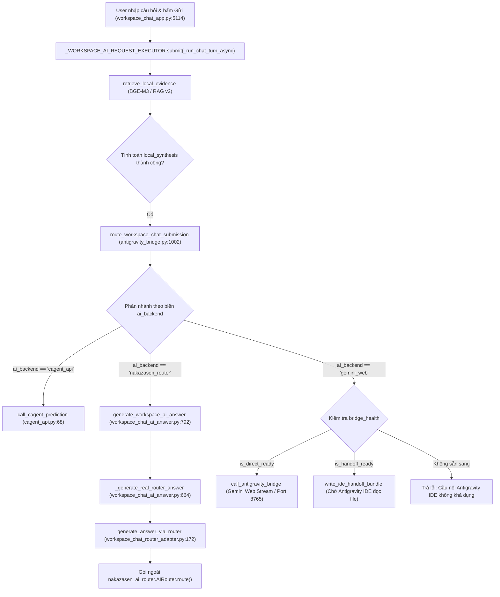

# Báo cáo truy vết kiến trúc: Đường tổng hợp câu trả lời của giao diện Chat (UI-SYNTH-ROUTE-TRACE-HOME)

- **Mã vé**: `UI-SYNTH-ROUTE-TRACE-HOME`
- **Loại vé**: PLAN — Truy vết kiến trúc & đối chiếu thực nghiệm (Chỉ đọc, không sửa code)
- **Máy thực hiện**: Nhà `h410asrock` (Thợ `agy`)
- **Thời điểm**: 2026-10-08 12:15 +07
- **Căn cứ**: Kết quả nghiệm thu thực tế vé `APP-E2E-POOL-HOME` (0/3 câu LSU có câu trả lời trên app thật, UI rơi vào lỗi sau 175–475s); phát hiện mâu thuẫn giữa báo cáo MD và kết quả JSON; sự phân tách giữa đường tổng hợp của UI và đường lane script của Pool Command Code.

---

## 1. Bản đồ đường đi đầy đủ từ lúc bấm "Gửi" tới khi hiển thị đáp án / lỗi

### 1.1. Luồng kích hoạt & phân nhánh quyết định chọn Backend AI
Khi người dùng bấm nút **Hỏi** (`wsc-action-*` / `wsc_ask_*`) hoặc nhấn **Ctrl+Enter** trên giao diện `workspace_chat_app.py`:



### 1.2. Cơ chế quyết định Backend AI trong UI (`ai_lane.py`)
Tại `src/aios_habit/ai_lane.py:71-108` (`select_ai_backend`) và `workspace_chat_app.py:3535, 4337`:
Hệ thống phân giải backend theo thứ tự ưu tiên sau:

1. **Ghim tay (Manual Override)**:
   - Đọc từ biến môi trường `AIOS_AI_BACKEND` (`ai_lane.py:80-86`).
   - Nếu `AIOS_AI_BACKEND="nakazasen_router"` (như script E2E ghim tại `run_app_e2e_pool.py:143`), UI bị khóa cứng vào `backend="nakazasen_router"` với nhãn `"Đang dùng: Nakazasen Router (ghim tay)"`.
   - Nếu người dùng chọn qua UI: ghi vào `st.session_state[f"wsc_ai_lane_{active_conversation_id}"]`.
2. **Tự động (Automatic - khi không ghim tay)**:
   - Ưu tiên 1: `bridge_available` (cổng 8765 bridge sống) -> Chọn `gemini_web` ("Gemini qua cầu nối").
   - Ưu tiên 2: `cagent_endpoint.strip()` có cấu hình URL C-Agent -> Chọn `cagent_api` ("C-Agent").
   - Ưu tiên 3: `router_keys_present` (tồn tại các key như OPENROUTER_API_KEY, GROQ_API_KEY, GEMINI_API_KEY...) và không bị cooldown -> Chọn `nakazasen_router` ("Nakazasen Router").
   - Ưu tiên 4: Không có lane ngoài nào -> Rơi về `local` ("Chạy cục bộ").

### 1.3. Liệt kê TẤT CẢ các backend tổng hợp mà UI có thể rơi vào

| Backend trên UI | Vị trí mã nguồn thực thi | Thư viện / Dịch vụ đích | Điều kiện kích hoạt |
|---|---|---|---|
| **`nakazasen_router`** | `src/aios_habit/workspace_chat_router_adapter.py:125` | Gói ngoài `nakazasen_ai_router` (PyPI package) | Ghim `AIOS_AI_BACKEND=nakazasen_router` hoặc auto khi có API key cloud ngoài. |
| **`gemini_web`** | `src/aios_habit/antigravity_bridge.py:1359` | Sidecar local bridge (HTTP port 8765) -> Browser Gemini Stream | `bridge_health.is_direct_ready == True` hoặc `AIOS_AI_BACKEND=gemini_web`. |
| **`gemini_web` (Handoff)** | `src/aios_habit/antigravity_bridge.py:1497` | IDE Outbox Bundle (`local_runs/handoff/...`) | `bridge_health.is_handoff_ready == True`. |
| **`cagent_api`** | `src/aios_habit/cagent_api.py:68` | Server nội bộ C-Agent Flowise (`https://kdtvn-ai.cmcts.vn/...`) | `cagent_endpoint` có giá trị hoặc `AIOS_AI_BACKEND=cagent_api`. |
| **`local`** | `src/aios_habit/antigravity_bridge.py:1534` | Trích xuất trực tiếp từ các đoạn văn bản nguồn (Extractive Fallback) | Không có kết nối mạng hoặc không có key cloud nào khả dụng. |
| **Đường Pool Command Code (RAG v2)** | `src/aios_habit/rag_v2_synthesis_provider.py:88` | `aios_habit.ai_router` -> Pool Command Code (`api.commandcode.org`) | **HIỆN TẠI KHÔNG ĐƯỢC NỐI VÀO UI!** Chỉ các script lane đo (`do_rag_50_*.py`) gọi trực tiếp qua `RouterSynthesisProvider`. |

---

## 2. Gỡ bỏ mâu thuẫn MD ↔ JSON trong vé E2E

### 2.1. Hiện tượng mâu thuẫn
- **Báo cáo MD (`app-e2e-pool-home.md`)**:
  - Ghi nhận `Model phục vụ: nakazasen_router`.
  - Nhận xét kỹ thuật: Lỗi do router ngoài dò tìm các khóa `OPENROUTER_API_KEY`, `DEEPSEEK_API_KEY`... và bị timeout.
- **Tệp JSON phiên đo (`app-e2e-pool-home-results.json`)**:
  - Ghi `model_phuc_vu: "verified_gemini_stream"` cho cả 3 câu.
  - Trường `provenance`: `provider_name: "Gemini Web Stream"`, `model_name: "verified_gemini_stream"`.
  - Đáp án câu 1: `"⚠️ Dịch vụ C-Agent phản hồi quá 60 giây. Vui lòng thử lại với câu hỏi ngắn gọn hơn."`

### 2.2. Bằng chứng thực tế gỡ mâu thuẫn

#### Bằng chứng 1: Log app thực tế trong `local_runs/workspace_chat_app_live.log`
Log tiến trình Streamlit của phiên đo E2E ghi lại toàn bộ dòng cảnh báo từ dòng 9–16:
```text
Provider openrouter failed with unknown_transport_error; trying next candidate
Provider gemini failed with provider_5xx; trying next candidate
Provider groq failed with unknown_transport_error; trying next candidate
Provider deepseek failed with unknown_transport_error; trying next candidate
Provider nvidia_nim failed with model_unavailable; trying next candidate
Provider nvidia_nim failed with model_unavailable; trying next candidate
Provider local_openai_compatible failed with transport_error; trying next candidate
Provider chatanywhere failed with auth_failure; trying next candidate
```
Dòng log này xuất phát từ tệp `nakazasen_ai_router/core.py` (dòng `LOGGER.warning("Provider %s failed with %s; trying next candidate", provider.name, error_type)`).
-> **Khẳng định 100%**: Backend thực sự chạy trong phiên đo là **`nakazasen_router`**, hoàn toàn **KHÔNG PHẢI** `Gemini Web Stream`.

#### Bằng chứng 2: Nguồn gốc của `verified_gemini_stream` trong tệp JSON
Tại `local_runs/run_app_e2e_pool.py:479-491`:
```python
# Xác định model thực phục vụ từ evidence trace trong database
from aios_habit.workspace_chat_store import load_all_evidence_traces
traces = load_all_evidence_traces()
used_model = "inclusionai/ling-3.0-flash-sante:free"
prov = {}
if traces:
    latest = traces[-1]
    prov = getattr(latest, "provenance", {}) or {}
    model_prov = prov.get("model_name", "")
    if model_prov and model_prov != "configured_by_provider":
        used_model = model_prov
```
- Khi lượt hỏi đáp trên UI bị lỗi (`ok == False`), hàm `save_evidence_trace` tại `src/aios_habit/antigravity_bridge.py:1262` **không bao giờ được gọi**.
- Do đó, trong cơ sở dữ liệu `workspace_chat.db` **không có bất kỳ trace mới nào được sinh ra cho 3 câu hỏi của phiên E2E**.
- Script `run_app_e2e_pool.py` đọc mù quáng `traces[-1]`. Trace cuối cùng trong cơ sở dữ liệu thực chất là:
  - `trace_id`: `trc_8162e59de311`
  - `query`: `"Cấu hình tối ưu là gì?"`
  - `conversation_id`: `CONV-CE9E141C` (một phiên thử nghiệm cũ độc lập)
  - `provenance`: `{"operational_mode": "direct", "provider_name": "Gemini Web Stream", "model_name": "verified_gemini_stream"}`.
- Script runner đã lấy nhầm trace cũ này gán vào kết quả của Câu 2 và Câu 3 trong JSON!

#### Bằng chứng 3: Nguồn gốc chuỗi "Dịch vụ C-Agent phản hồi quá 60 giây" ở Câu 1
Kiểm tra trực tiếp lịch sử tin nhắn trong `workspace_chat_store.py` (`load_all_messages()`):
Trong hội thoại `CONV-6034EFB8`, trước khi phiên E2E chính thức chạy, đã có một đợt chạy thử qua C-Agent:
- `MSG-ABCDB4FB` (user): `C7620中Magenta相对Black...`
- `MSG-A5F2ECCA` (assistant): `⚠️ Dịch vụ C-Agent phản hồi quá 60 giây. Vui lòng thử lại với câu hỏi ngắn gọn hơn.`
Khi runner E2E khởi động, hội thoại `CONV-6034EFB8` được nạp lên giao diện. Ở câu 1, do thời gian BGE cold start kéo dài (~270s) và cơ chế DOM scraper của runner đọc phần tử assistant message cuối cùng hiện có trên trang (`last_text`), nó đã cào trúng văn bản lỗi cũ của C-Agent còn lưu lại trên giao diện.
Trong khi đó, tệp checkpoint của chính câu 1 (`app-e2e-pool-home-cau1.json:9`) và ảnh chụp màn hình thực tế (`app-e2e-pool-home-02-cau1-c7620.png`) ghi rõ câu trả lời thực sự trên màn hình lúc đó là:
`"⚠️ Dịch vụ AI chưa phản hồi. Vui lòng kiểm tra lại kết nối mạng hoặc cấu hình API key."`

**Kết luận mục 2**:
Mâu thuẫn đã được giải mã triệt để. Đường thực sự chạy 100% cho cả 3 câu là **`nakazasen_router`**. Trường `verified_gemini_stream` và chuỗi lỗi C-Agent trong JSON là do lỗi cào dữ liệu (artifact của runner khi đọc trace cũ và DOM cũ khi câu hỏi bị fail).

---

## 3. Vì sao chờ 175–475 giây mới báo lỗi?

### 3.1. Phân rã độ trễ từng câu
Tổng thời gian chờ của người dùng được cấu thành từ 2 pha:
$$\text{Tổng thời gian} = \text{Pha 1 (BGE Retrieval)} + \text{Pha 2 (AI Router Loop)}$$

1. **Câu 1 (`Q0699`) - 475.59 giây (~7.9 phút)**:
   - **Pha 1 (Khởi động lạnh BGE Worker)**: Chiếm **~270 giây** (~4.5 phút). Trên phần cứng CPU-only của máy nhà `h410asrock`, tiến trình con nạp mô hình ONNX BGE-M3 fp32 dung lượng 1.8GB và nạp dữ liệu vector của 149.800 mảnh tài liệu.
   - **Pha 2 (Vòng lặp thử ứng viên Router)**: Chiếm **~205 giây** (~3.4 phút). Gói ngoài `nakazasen_ai_router` duyệt tuần tự qua danh sách 8 nhà cung cấp cloud ngoài.
2. **Câu 2 (`Q0718`) - 315.11 giây (~5.2 phút)**:
   - **Pha 1**: BGE worker đã ấm trong bộ nhớ qua Named Pipe, pha truy xuất hoàn tất trong **~20 giây**.
   - **Pha 2**: Vòng lặp thử ứng viên router duyệt qua các provider, dính timeout và retry/recovery, kéo dài **~295 giây**.
3. **Câu 3 (`Q0709`) - 174.94 giây (~2.9 phút)**:
   - **Pha 1**: BGE worker ấm, truy xuất xong trong **~15 giây**.
   - **Pha 2**: Các provider trước đó đã vào trạng thái `cooldown` trong `state_store`, số provider phải thử giảm xuống, kéo dài **~160 giây**.

### 3.2. Cấu trúc vòng lặp thử ứng viên và Timeout
Tại `nakazasen_ai_router`:
Mỗi provider có cấu hình timeout mạng mặc định là **`30.0` giây** (`timeout = 30.0`):
- `openrouter`: timeout 30s -> lỗi `unknown_transport_error`
- `gemini`: HTTP 5xx -> retry với exponential backoff (~30–40s)
- `groq`: timeout 30s -> lỗi `unknown_transport_error`
- `deepseek`: timeout 30s -> lỗi `unknown_transport_error`
- `nvidia_nim`: model unavailable -> kích hoạt cơ chế `ModelRecoveringProvider` thử lại với model thay thế (~10s)
- `local_openai_compatible`: kết nối tới localhost không có service -> timeout/transport error 30s
- `chatanywhere`: xác thực thất bại (`auth_failure`) -> ~1s

Tổng cộng: $6 \times 30\text{s} + \text{retries} \approx 180 - 240\text{s}$ chờ đợi trước khi ném ra `RouterError("No provider returned a result")`.

### 3.3. Vì sao đường UI không có cơ chế fallback trích cục bộ như lane script?
- **Đường lane script (`RouterSynthesisProvider` + `synthesis.py`)**:
  Tại `src/aios_habit/rag_v2/synthesis.py:936-1080`, khi gọi model cloud thất bại (mạng, timeout, 429), hàm tự động bọc lại và trả về `fallback = _citation_first_fallback()` (câu trả lời trích xuất trực tiếp từ các đoạn tài liệu có trích dẫn `[citation_id]`). Nhờ đó, 50/50 câu trong lane đo buổi sáng đều có câu trả lời hoàn chỉnh (GPA 1.25), không bao giờ văng lỗi.
- **Đường UI (`workspace_chat_app.py` & `antigravity_bridge.py`)**:
  - Tại `src/aios_habit/workspace_chat_rag_v2_adapter.py:2718`, pha retrieval **đã tính sẵn** `local_synthesis` và truyền vào `route_workspace_chat_submission(..., local_synthesis=...)`.
  - Tuy nhiên, trong `src/aios_habit/antigravity_bridge.py:1208-1230` (nhánh `nakazasen_router`):
    ```python
    result = generate_workspace_ai_answer(request, object())
    if not result.ok:
        return (False, "", None, result.error_message or "Cầu nối AI không trả về câu trả lời.")
    ```
    Hàm lập tức thoát và trả lỗi `result.error_message` ("Dịch vụ AI chưa phản hồi..."), **hoàn toàn bỏ qua trường `local_synthesis`**!
  - Cơ chế `_local_fallback_available(local_synthesis)` tại dòng 1534 chỉ được lập trình cho nhánh `else:` của `gemini_web` khi bridge chết hẳn, không được đấu nối vào nhánh `nakazasen_router`.

---

## 4. Vị trí của Pool Command Code & Điểm nối hợp nhất

### 4.1. Cấu hình `.env` máy nhà hiện tại
Tệp `.env` tại máy nhà `h410asrock` đã cấu hình đầy đủ các biến của Pool Command Code:
- `AIOS_LOCAL_AI_ENDPOINT = https://api.commandcode.org/v1`
- `AIOS_LOCAL_AI_API_KEY = <đã cấu hình — không ghi giá trị>`
- `AIOS_LOCAL_AI_MODEL = inclusionai/ling-3.1-flash:free`
- `AIOS_LOCAL_AI_FAILOVER_MODELS = poolside/laguna-s-2.1-free,inclusionai/ling-3.0-flash-sante:free`
- `AIOS_SYNTHESIS_ALLOW_CLOUD_PROVIDERS = 1`
- `AIOS_LOCAL_AI_LOCALITY = cloud`

### 4.2. Đường UI hiện tại có đọc cấu hình này không?
**KHÔNG**.
- Các biến `AIOS_LOCAL_AI_*` chỉ được đọc bởi `src/aios_habit/ai_router.py` (các dòng 509, 589) và `ai_provider_bridge.py` (dòng 121).
- Đường UI Workspace Chat lại gọi sang gói thư viện ngoài `nakazasen_ai_router.create_router_from_env()`. Gói ngoài này chỉ đọc các biến riêng lẻ như `OPENROUTER_API_KEY`, `GROQ_API_KEY`, `DEEPSEEK_API_KEY`... và hoàn toàn không biết đến `AIOS_LOCAL_AI_ENDPOINT` hay `AIOS_LOCAL_AI_API_KEY` của pool Command Code.

### 4.3. Các điểm nối cụ thể để hợp nhất UI về Pool Command Code (Chỉ chỉ ra, không sửa)

1. **Điểm nối 1: Adapter gọi Router (`src/aios_habit/workspace_chat_router_adapter.py`)**:
   - Hiện tại: `_get_router()` gọi `create_router_from_env()` từ gói ngoài `nakazasen_ai_router`.
   - Điểm nối: Thay thế hoặc bổ sung adapter nội bộ gọi sang `aios_habit.ai_router.route_answer()` hoặc `aios_habit.rag_v2_synthesis_provider.RouterSynthesisProvider`. Tuyến này tự động nhận diện pool Command Code từ `.env` qua `provider_configs_from_env()`.
2. **Điểm nối 2: Cơ chế Fallback an toàn (`src/aios_habit/antigravity_bridge.py:1228`)**:
   - Hiện tại: Khi `not result.ok`, trả về ngay `result.error_message`.
   - Điểm nối: Nếu `result.ok` là False hoặc router lỗi, kiểm tra `local_synthesis` (đã có sẵn trong tham số hàm tại dòng 1023). Nếu có `local_synthesis`, đóng gói trả lời bằng nội dung trích xuất cục bộ kèm badge minh bạch (`operational_mode: "local_grounded_fallback"`).
3. **Điểm nối 3: Định nghĩa AI Lane (`src/aios_habit/ai_lane.py`)**:
   - Tại dòng 21–40 và hàm `select_ai_backend`: Nhận diện sự hiện diện của Pool Command Code qua `AIOS_LOCAL_AI_ENDPOINT` & `AIOS_LOCAL_AI_API_KEY` để tự động chọn lane Pool hoặc ghim `AIOS_AI_BACKEND=commandcode_pool`.
4. **Điểm nối 4: Sửa bộ thu thập kết quả E2E Runner (`local_runs/run_app_e2e_pool.py:480`)**:
   - Lọc trace theo đúng `conversation_id` của phiên đo thay vì đọc mù quáng `traces[-1]`.

---

## 5. Đề xuất vé sửa tiếp theo

### 5.1. Tên vé đề xuất
`UI-SYNTH-UNIFY-POOL-HOME`: Hợp nhất đường tổng hợp của giao diện Chat về Pool Command Code và cơ chế Fallback trích cục bộ.

### 5.2. Phạm vi thực hiện tối thiểu
1. **Đấu nối Adapter**: Chuyển hướng `workspace_chat_router_adapter.py` sang sử dụng bộ định tuyến nội bộ `aios_habit.ai_router` (hoặc `RouterSynthesisProvider`), đọc trực tiếp cấu hình pool Command Code từ `.env`.
2. **Kích hoạt Fallback trích cục bộ**: Tại `antigravity_bridge.py:route_workspace_chat_submission`, khi gọi pool gặp sự cố mạng/429/timeout, lập tức trả về `local_synthesis` với thông báo minh bạch: *"Đã trả lời từ trích đoạn tài liệu cục bộ (AI cloud bận)"*.
3. **Sửa runner kiểm thử**: Cập nhật `run_app_e2e_pool.py` để trích xuất model và trace chính xác theo `conversation_id`.

### 5.3. Rủi ro & Thứ tự thực hiện
- **Thứ tự việc**:
  1. *Bước 1*: Viết Unit Test cho adapter mới (xác minh gọi đúng Pool Command Code và fallback cục bộ khi mock lỗi).
  2. *Bước 2*: Cập nhật `workspace_chat_router_adapter.py` và `antigravity_bridge.py`.
  3. *Bước 3*: Chạy kiểm thử tự động toàn diện (`compileall`, `pytest`, `cli audit`).
  4. *Bước 4*: Chạy lại E2E nghiệm thu sử dụng thật trên Streamlit (`run_app_e2e_pool.py`) với 3 câu LSU.
- **Rủi ro & Giải pháp**:
  - *Rủi ro*: Có thể làm ảnh hưởng tới các test cũ kiểm tra mock của `nakazasen_ai_router`.
  - *Giải pháp*: Giữ nguyên chữ ký hàm của `WorkspaceChatRouterAdapter`, chỉ thay đổi tầng thực thi bên dưới hoặc chuyển qua cờ cấu hình an toàn.
