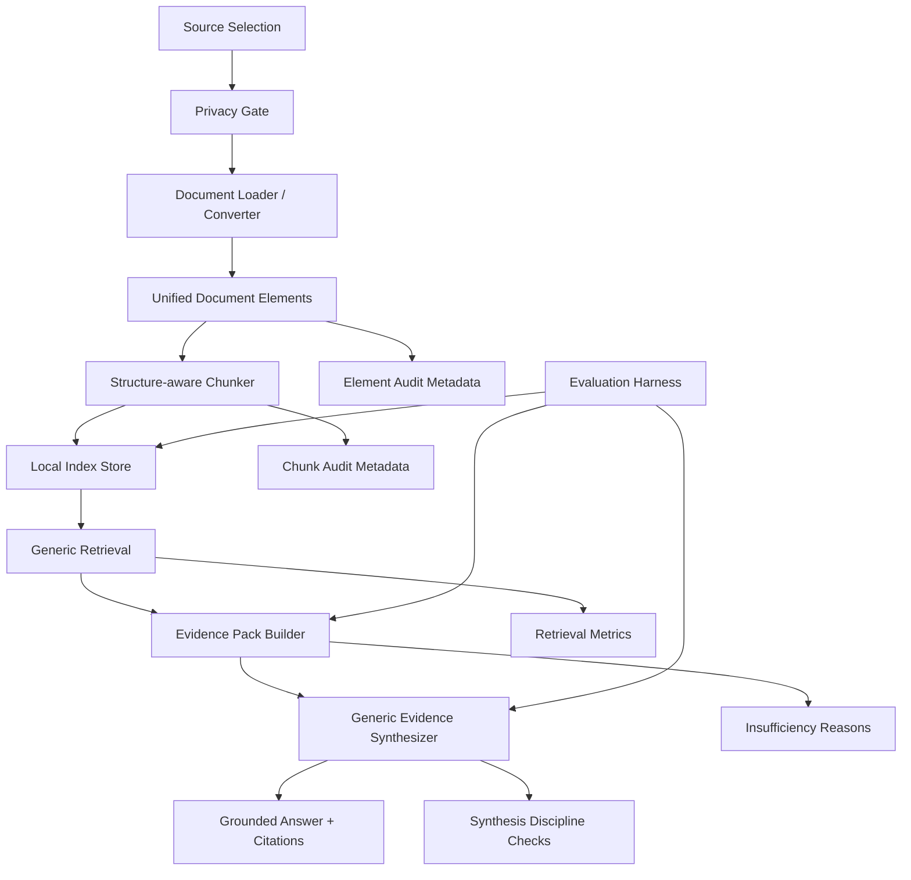

# RAG V2 Design

Status: `DRAFT_FOR_OWNER_REVIEW`

Date: 2026-07-06

Repo/head: `AIOS_habbit` at `957cf857162002075199c27763603378acd2d5aa`

Scope: design only. This document does not implement runtime code, add dependencies, change UI, open A18/P1.0, or modify roadmap/changelog files.

## 1. Goals

RAG v2 is the generic WorkLens retrieval and answer foundation. It must be:

- **Generic:** works across manufacturing, accounting, IT/logs, legal/work documents, translation/multilingual docs, Excel-heavy workflows, images, and logs.
- **Local-first:** conversion, indexing, retrieval, and evidence packaging default to local execution.
- **Element-first:** documents are converted into typed elements before chunking or indexing.
- **Privacy-first:** privacy labels flow through elements, chunks, index entries, evidence packs, and synthesis.
- **Evidence-grounded:** every answer claim must be backed by source evidence or marked insufficient.
- **Side-by-side with legacy MOM:** current `mom_*` pilot code remains available while RAG v2 matures.
- **Workspace Chat safe:** no normal UI disruption, no new technical panels/tabs, and no extra complexity for the owner.
- **NotebookLM-simple:** the owner flow remains add/select sources, ask naturally, and receive grounded answers.

## 2. Non-goals

RAG v2 design explicitly does **not** include:

- Hard-coded MOM/WMS business logic in core RAG.
- Router Server work.
- Cloud LLM by default.
- Vector DB as the first mandatory index.
- Big-bang rewrite of Workspace Chat or MOM pilot.
- P1.0 opening.
- A18 opening.
- IDE bridge opening.
- New normal-user UI, technical tabs, panels, or workflow complexity.
- Dependency additions in this design gate.

## 3. Current legacy assessment

Current relevant legacy modules:

- `src/aios_habit/mom_local_index.py`
- `src/aios_habit/document_extractors.py`
- `src/aios_habit/mom_benchmark.py`

Assessment:

- `mom_local_index.py` is a legacy MOM pilot index. It is useful evidence that local indexing can work, but it is not generic RAG core.
- `document_extractors.py` has useful file extractors and fail-soft behavior, but the output is chunk-first rather than element-first.
- `search_mom_index` contains domain-tuned boosts for the MOM pilot. That is acceptable during legacy transition, but the pattern must not be copied into RAG v2 core.
- `generate_mom_grounded_answer` is privacy-safe and source-grounded, but it primarily lists snippets/source refs. It is not a strong generic evidence synthesizer.

## 4. Target architecture



Layer responsibilities:

1. **Source Selection:** receives enabled sources from Workspace Chat or benchmark runner.
2. **Privacy Gate:** blocks disabled sources and enforces local-only defaults.
3. **Document Loader / Converter:** detects file type and dispatches to adapters.
4. **Unified Document Elements:** stable typed representation for all supported formats.
5. **Structure-aware Chunker:** creates chunks using document structure where available.
6. **Local Index Store:** stores searchable text plus metadata locally.
7. **Generic Retrieval:** retrieves without business-specific terms.
8. **Evidence Pack Builder:** normalizes ranked evidence, citations, scores, and gaps.
9. **Generic Evidence Synthesizer:** answers from evidence only.
10. **Evaluation Harness:** measures retrieval, citation, faithfulness, and insufficiency behavior.

## 5. DocumentElement schema

RAG v2 should introduce a generic `DocumentElement` concept with at least:

| Field | Purpose |
|---|---|
| `element_id` | Stable element identifier. |
| `document_id` | Stable document identifier. |
| `source_path` | Local relative or safe source path. |
| `source_name` | Display-safe file/source name. |
| `file_type` | Normalized extension or MIME-like type. |
| `extractor` | Converter/adapter name and version if available. |
| `extraction_status` | Success, partial, unsupported, dependency missing, or failed. |
| `extraction_warning` | Safe warning without raw secrets or stack traces. |
| `page` | Page number/range for PDFs/images. |
| `slide` | Slide number/range for PPTX. |
| `sheet` | Sheet name for spreadsheets. |
| `row_range` | Spreadsheet/table row range. |
| `column_range` | Spreadsheet/table column range. |
| `cell_range` | Spreadsheet cell range, e.g. A1:D20. |
| `bbox` | Optional layout coordinates for PDF/image regions. |
| `element_type` | `title`, `heading`, `text`, `table`, `list`, `image`, `ocr`, `log`, `metadata`. |
| `text` | Raw extracted text for the element. |
| `normalized_text` | Retrieval-normalized text preserving Vietnamese/Japanese/English. |
| `table.headers` | Optional table headers. |
| `table.rows` | Optional table row values. |
| `table.cells` | Optional cell-level records with row/column/value. |
| `language_hint` | Best-effort language hint. |
| `confidence` | Extraction/OCR/layout confidence if known. |
| `privacy_labels` | Labels such as local-only, machine-only, public/test, or owner-approved. |
| `checksum` | Element checksum. |
| `source_fingerprint` | Source file fingerprint for stale checks. |
| `parent_element_id` | Parent heading/page/table relation. |
| `section_path` | Hierarchical section path. |
| `created_at` | Source record creation time if known. |
| `indexed_at` | Local indexing timestamp. |

## 6. Converter adapter interface

Python-like interface:

```python
class DocumentConverterAdapter:
    def supports(self, path: str, file_type: str | None = None, mime: str | None = None) -> bool:
        """Return True if this adapter can attempt conversion."""

    def convert(self, path: str, context: ConversionContext) -> list[DocumentElement]:
        """Return typed elements. Fail soft with unsupported/failed elements when needed."""

    def capabilities(self) -> dict:
        """Return supported file types, table/layout/OCR capability, dependency status, and privacy notes."""
```

Initial adapters:

- `ExistingExtractorAdapter`
  - Wraps the current extractor behavior to preserve existing capabilities.
  - Emits `DocumentElement` records instead of immediate chunks.
- `OpenPyxlTableAdapter`
  - Handles XLSX/XLSM more structurally.
  - Preserves sheet, row, column, and cell range metadata.
- `PyMuPDF4LLMAdapter`
  - Handles local PDF text-layer extraction.
  - Does not treat Markdown text as sufficient for all layout/table use cases.

Optional/future adapters:

- `DoclingAdapter`
  - For richer document conversion, layout, tables, reading order, and OCR mindset.
- `UnstructuredAdapter`
  - For typed element partitioning and metadata-rich extraction.
- `TikaAdapter`
  - For broad file type detection/extraction fallback if operationally acceptable.

## 7. File format strategy

| Format | Extraction target | Metadata to keep | Fail-soft behavior | Privacy concern | Test fixture |
|---|---|---|---|---|---|
| PDF | Page/section text, headings where possible, tables where possible, OCR blocks later. | page, bbox, extractor, status, source fingerprint. | Return partial text or dependency-missing element. | PDFs often contain confidential business docs; local-only default. | Synthetic PDF or monkeypatched extractor output. |
| DOCX | Paragraphs, headings, lists, tables. | section path, table structure, source fingerprint. | Return text-only partial if table extraction fails. | May contain contracts/internal docs. | Minimal generated DOCX fixture. |
| PPTX | Slide text, notes, embedded image markers. | slide number, notes flag, media count. | Return extracted text or unsupported if no readable XML payload. | Slides may include screenshots/customer data. | Synthetic PPTX zip fixture. |
| XLSX/XLSM | Sheets, tables, headers, row/cell values. | sheet, row/column/cell ranges, formulas/data-only mode note. | Return partial sheets and warnings for unreadable sheets. | Excel is high-risk for company data; no cloud by default. | Small workbook with headers/cells. |
| CSV | Rows, headers, delimiter-aware text/table. | row range, column names, encoding warning. | Return partial rows with warning on bad encoding. | Could contain exports from production/accounting. | Small CSV fixture. |
| TXT/log | Paragraphs or log blocks. | line range, timestamp pattern if detected. | Return text chunks; preserve line ranges. | Logs may include paths/tokens; sanitize outputs. | Synthetic logs with timestamps. |
| HTML | Visible text, headings, lists, tables. | heading path, element type, table markers. | Strip script/style; return visible text or failed reason. | May contain exported internal pages. | Minimal HTML fixture. |
| PNG/JPG/image OCR | OCR text blocks and image metadata. | image dimensions, OCR engine/lang/confidence, page/bbox. | If OCR unavailable, return safe unsupported element. | Screenshots may expose secrets or company UI. | Image with simple text; OCR-unavailable fail-soft test. |

## 8. Structure-aware chunking

Chunking must prefer structure over blind character slicing:

- **heading/section:** group text under headings and preserve section path.
- **page:** chunk PDFs/images by page or page region when available.
- **slide:** chunk PPTX by slide and notes.
- **sheet/table:** chunk spreadsheet tables by sheet, table, row groups, and header context.
- **row/cell range:** preserve precise spreadsheet coordinates for citations.
- **log block:** group logs by timestamp/session/error block.
- **OCR image block:** group OCR blocks by image/page/region and confidence.

Fallback character chunking remains allowed only when no better structure exists. Fallback chunks must record that they are fallback chunks.

## 9. Local index strategy

MVP should use:

- SQLite FTS/BM25 as the primary local searchable store.
- JSONL debug/export for transparency and recovery.
- Optional vector index later, after local lexical baseline and privacy review.
- No cloud index by default.

Index schema concept:

- `documents`
  - `document_id`, `source_name`, `source_path`, `file_type`, `source_fingerprint`, `privacy_labels`, `indexed_at`, `enabled_snapshot`.
- `elements`
  - `element_id`, `document_id`, `element_type`, `text`, `normalized_text`, structure metadata, confidence, checksum.
- `chunks`
  - `chunk_id`, `document_id`, `element_ids`, `chunk_text`, citation metadata, privacy labels, source fingerprint.
- `chunks_fts`
  - FTS/BM25 searchable text.

Required filters:

- metadata filter by file type, source, element type, page/sheet/slide.
- privacy filter by labels and consent status.
- source filter by enabled source set.
- disabled source exclusion.
- stale fingerprint protection: if source fingerprint differs from the indexed snapshot, require reindex or mark stale.

## 10. Generic retrieval/rerank design

Core retrieval must not hard-code business terms. It can use generic signals:

- lexical/BM25 score.
- exact phrase match.
- filename/title/source path match.
- element type match.
- table header/cell match.
- source diversity.
- extraction confidence.
- recency/index freshness when useful.
- privacy allowed/blocked state.
- weak/negative evidence handling.

Generic query understanding may detect only answer shapes:

- comparison.
- list/enumeration.
- summarize.
- explain flow.
- field mapping.
- find evidence.
- troubleshoot/root cause.

Core retrieval must not detect or special-case MOM/WMS intent.

Rerank concept:

1. Retrieve broad lexical candidates with metadata filters.
2. Apply exact phrase and title/path boosts generically.
3. Apply table-aware boosts for header/cell matches.
4. Diversify by source and element type.
5. Penalize stale, low-confidence, or privacy-disallowed evidence.
6. Return insufficient-evidence reasons when scores are weak or coverage is incomplete.

## 11. Evidence pack format

Evidence pack fields:

```yaml
query: string
query_shape: comparison | list | summarize | flow | field_mapping | find_evidence | troubleshoot | unknown
selected_sources:
  - source_id
  - source_name
  - source_fingerprint
  - privacy_labels
evidence_items:
  - evidence_id
  - citation_label
  - document_id
  - element_id
  - chunk_id
  - source_name
  - source_path
  - page
  - slide
  - sheet
  - row_range
  - column_range
  - cell_range
  - element_type
  - text_excerpt
  - score
  - ranking_signals
  - extraction_status
  - confidence
confidence: high | medium | low | insufficient
insufficiency_reasons:
  - reason
suggested_next_checks:
  - check
privacy_summary:
  local_only: true
  cloud_allowed: false
```

## 12. Generic response synthesis discipline

The synthesizer core knows generic answer formats only:

- comparison.
- table.
- bullet list.
- flow.
- field mapping.
- summary.
- Q&A.

Rules:

- Every claim must be grounded in evidence.
- Every material claim must cite source refs.
- Requested points not found in evidence go to insufficient evidence.
- Do not hallucinate missing fields, procedures, values, or causes.
- Do not use domain-specific templates in core.
- Local-only is the default.
- Cloud synthesis, if added later, must go through existing owner consent, source snapshot, privacy label, and route log gates.

## 13. Eval harness design

Evaluation must include:

- generic synthetic fixtures.
- per-file-type tests.
- retrieval hit@k.
- citation correctness.
- answer faithfulness.
- insufficient-evidence discipline.
- benchmark config schema.
- NotebookLM comparator only, not ground truth.
- MOM/WMS 52-file and 68-file datasets as private local benchmarks only; raw data must not be committed.

Benchmark config concept:

```yaml
benchmark_id: string
privacy: private_local | synthetic_public
sources:
  - path
questions:
  - id
    question
    expected_evidence_patterns
    required_answer_points
    forbidden_hallucinations
metrics:
  - retrieval_hit_at_k
  - citation_correctness
  - answer_faithfulness
  - insufficient_evidence_discipline
```

## 14. Hard-code prevention policy

Forbidden in core RAG v2 modules:

- MES
- MOM
- ManualShipping
- 生産履歴
- C31
- C32
- kdcRenameShipChangeQty
- domain-specific Japanese function names
- customer/project-specific table names
- benchmark-only expected answers

Allowed only in:

- benchmark prompts.
- synthetic fixtures.
- private local eval configs not committed.
- docs describing historical MOM pilot.
- legacy `mom_*` modules during migration.

Review checks:

- Scan `rag_v2*` source modules for forbidden business terms.
- Verify retrieval tests do not depend on business-specific scoring rules.
- Ensure domain tuning is external config/eval only, not core logic.

## 15. Privacy gates

Privacy flow:

1. Source selection includes only enabled sources.
2. Disabled sources are excluded before conversion/retrieval.
3. Every element receives privacy labels.
4. Every chunk inherits and can only restrict privacy labels.
5. Every index entry stores privacy labels.
6. Every evidence pack includes privacy summary.
7. Whole store is never sent to any model/tool.
8. Local-only is the default.
9. Optional cloud synthesis must pass:
   - owner consent.
   - source snapshot check.
   - privacy label check.
   - source set check.
   - route logging.
10. No raw API key, prompt, or full source logging.

## 16. Migration plan

Migration must be side-by-side:

- Do not break MOM legacy index.
- Do not change Workspace Chat normal UI.
- Do not change owner's normal flow.
- Do not do a big-bang rewrite.
- Runtime outputs stay under ignored local paths.

Proposed gates:

1. `RAG-V2-ELEMENT-SCHEMA-AND-ADAPTER-INTERFACE`
   - Add generic schema and adapter protocol.
2. `RAG-V2-DOC-CONVERTER-ADAPTERS-MIN`
   - Wrap current extractors and add richer Excel/PDF adapters.
3. `RAG-V2-STRUCTURE-AWARE-CHUNKING-AND-LOCAL-INDEX-MIN`
   - Add structure-aware chunks and local SQLite FTS/BM25.
4. `RAG-V2-HYBRID-RETRIEVAL-MIN`
   - Add generic retrieval/rerank without business terms.
5. `RAG-V2-GENERIC-EVIDENCE-SYNTHESIS-MIN`
   - Add generic source-grounded answer synthesis.
6. `RAG-V2-EVAL-HARNESS-MOM-WMS-AND-GENERIC-DOCS`
   - Add generic and private benchmark harness.
7. `NOTEBOOKLM-BATTLE-RERUN-RAG-V2`
   - Rerun comparison after RAG v2 benchmark evidence exists.

Roadmap/changelog changes must be handled only in a separate owner-approved docs sync gate.

## 17. Test plan

Required tests:

- schema serialization and backwards-safe metadata defaults.
- adapter fail-soft behavior for missing dependencies and unreadable files.
- PDF text extraction with mocked converter output.
- Excel table/cell metadata preservation.
- PPTX slide and notes extraction.
- HTML/TXT/CSV/log extraction.
- image OCR unavailable fail-soft behavior.
- chunking by heading, page, slide, sheet, table, row/cell range, log block, and OCR block.
- retrieval has no business hard-code in core modules.
- privacy labels flow from source to element, chunk, index, evidence pack, and synthesis.
- synthesis citation and insufficient-evidence discipline.
- generic fixtures across manufacturing, accounting, IT/log, legal, translation, and Excel-heavy documents.

## 18. Rollback plan

- RAG v2 runs side-by-side and can be disabled by feature flag/config.
- MOM legacy index remains available.
- Workspace Chat UI remains unchanged.
- Runtime outputs stay under ignored local paths only.
- If RAG v2 retrieval/synthesis fails benchmark, revert to legacy path without data migration.
- No new dependency is mandatory until separately approved.

## 19. Owner review points

Owner decisions required:

1. Approve RAG v2 generic, element-first, local-first direction.
2. Approve stopping MOM-specific composer implementation.
3. Approve proposed design gate order.
4. Approve a separate docs-only sync gate after this design is accepted.
5. Approve keeping Workspace Chat UI simple with no new technical complexity.
