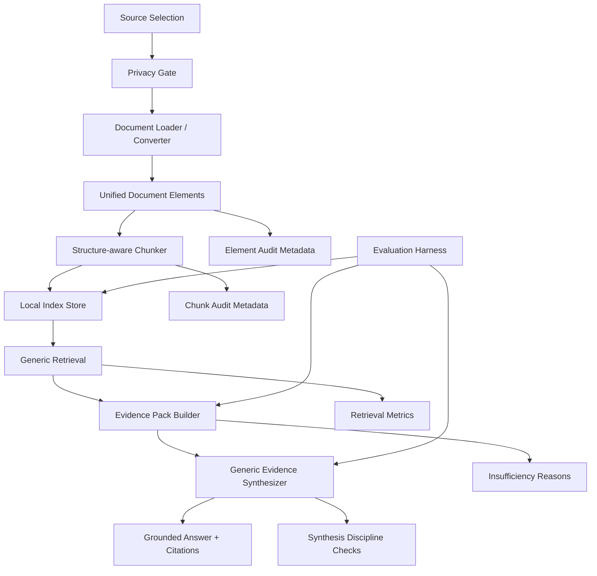

# Thiết Kế RAG v2 (RAG V2 Design)

Trạng thái: `ACTIVE_ARCHITECTURE_REFERENCE` (Tài liệu tham chiếu kiến trúc đang hoạt động)

Lần xem xét gần nhất: 2026-07-26

Triển khai Dev hiện tại đã hoàn thành: element schema/adapters, document converter adapters, structure-aware chunking, truy xuất SQLite FTS5/BM25 cục bộ bền vững với cơ chế dự phòng tất định, đóng gói bằng chứng cấp tập hợp (set-level), lập kế hoạch/xác thực tổng hợp độc lập với nhà cung cấp (provider-independent), khung đánh giá chỉ chạy cục bộ và CLI/điều phối Dev độc lập. Đợt đo chuẩn năng lực khép kín và quyết định không tuyên bố tương đương được ghi nhận trong [NOTEBOOKLM-BATTLE-RERUN-RAG-V2](../roadmap/completed/NOTEBOOKLM-BATTLE-RERUN-RAG-V2.md). Việc đóng cổng hội tụ chất lượng Dev được ghi nhận trong [RAG-V2-DEV-QUALITY-CONVERGENCE](../roadmap/completed/RAG-V2-DEV-QUALITY-CONVERGENCE.md) với kết luận `DEV_READY_WITH_LIMITATIONS` / `NOT_READY_FOR_PRIMARY_UI`.

Khắc phục tập ngữ liệu theo nguyên tắc fail-closed hoàn tất ngày 2026-07-26: `resolve_benchmark_source_root` hiện từ chối phương án dự phòng dùng thư mục gốc workspace; `build_local_manifest` xác thực chính xác số lượng 70 tệp; các trường nghĩa vụ chuẩn (gold obligations) được bổ sung vào khung đánh giá. Đợt đo chuẩn trực tiếp `BATTLE-RAGv2-1785003571-e33e5670` trên tập 70 tệp sạch: NotebookLM **4.27/5**, RAG v2 **3.15/5**, Workspace Chat **2.68/5**. NotebookLM thắng 11/11 câu hỏi so sánh. Kết luận: **HOLD** (TẠM DỪNG). Khoảng cách: -1.12 điểm (thâm hụt 26%).

Phạm vi: Tài liệu tham chiếu kiến trúc. Tài liệu này không tự ý mở cổng A18/P1.0, không thay đổi UI, không thêm dependency và không cấp quyền cho tuyến mạng mặc định/cloud.

## 1. Mục Tiêu (Goals)

RAG v2 là nền tảng truy xuất và trả lời tổng quát cho WorkLens. Hệ thống phải đảm bảo:

- **Tổng quát (Generic):** Hoạt động tốt trên nhiều lĩnh vực như sản xuất, kế toán, nhật ký IT, tài liệu pháp lý/công việc, tài liệu dịch thuật/đa ngôn ngữ, quy trình nặng về Excel, hình ảnh và log.
- **Ưu tiên cục bộ (Local-first):** Chuyển đổi, lập chỉ mục, truy xuất và đóng gói bằng chứng mặc định thực thi cục bộ.
- **Ưu tiên phần tử (Element-first):** Tài liệu được chuyển đổi thành các phần tử có định kiểu (typed elements) trước khi chia chunk hoặc lập chỉ mục.
- **Ưu tiên quyền riêng tư (Privacy-first):** Nhãn bảo mật xuyên suốt từ phần tử, chunk, mục chỉ mục, gói bằng chứng đến khâu tổng hợp.
- **Có căn cứ bằng chứng (Evidence-grounded):** Mọi tuyên bố trong câu trả lời phải được hỗ trợ bởi bằng chứng nguồn hoặc được gắn nhãn chưa đủ bằng chứng.
- **Chạy song song với MOM cũ:** Mã thử nghiệm `mom_*` hiện tại vẫn khả dụng trong khi RAG v2 hoàn thiện.
- **An toàn cho Workspace Chat:** Không làm xáo trộn giao diện thông thường, không thêm các tab/bảng điều khiển kỹ thuật phức tạp cho chủ sở hữu.
- **Đơn giản như NotebookLM:** Quy trình của chủ sở hữu vẫn giữ nguyên: thêm/chọn nguồn dữ liệu, hỏi đáp tự nhiên và nhận câu trả lời có căn cứ.

## 2. Các Phi Mục Tiêu (Non-goals)

Thiết kế RAG v2 rõ ràng **không** bao gồm:

- Gắn cứng (hard-code) logic nghiệp vụ MOM/WMS vào lõi RAG.
- Công việc của Router Server.
- Mặc định dùng Cloud LLM.
- Cơ sở dữ liệu Vector là chỉ mục bắt buộc đầu tiên.
- Viết lại toàn bộ (big-bang) Workspace Chat hoặc bản thử nghiệm MOM.
- Mở cổng P1.0.
- Mở cổng A18.
- Mở cổng cầu nối IDE.
- Giao diện người dùng mới, các tab kỹ thuật, hoặc gây phức tạp quy trình.
- Thêm dependency trong cổng thiết kế này.

## 3. Đánh Giá Hiện Trạng Kế Thừa (Current Legacy Assessment)

Các module kế thừa liên quan hiện tại:

- `src/aios_habit/mom_local_index.py`
- `src/aios_habit/document_extractors.py`
- `src/aios_habit/mom_benchmark.py`

Đánh giá:

- `mom_local_index.py` là chỉ mục thử nghiệm MOM cũ. Nó là bằng chứng hữu ích cho thấy việc lập chỉ mục cục bộ có thể hoạt động, nhưng nó không phải là lõi RAG tổng quát.
- `document_extractors.py` có các bộ trích xuất tệp hữu ích và hành vi dự phòng mềm (fail-soft), nhưng đầu ra ưu tiên chunk thay vì ưu tiên phần tử (element).
- `search_mom_index` chứa các trọng số boost được tinh chỉnh riêng cho đợt thử nghiệm MOM. Điều đó chấp nhận được trong giai đoạn chuyển đổi, nhưng không được sao chép vào lõi RAG v2.
- `generate_mom_grounded_answer` an toàn về bảo mật và có căn cứ nguồn, nhưng chủ yếu liệt kê trích dẫn/tham chiếu nguồn. Nó chưa phải là một bộ tổng hợp bằng chứng tổng quát mạnh mẽ.

## 4. Kiến Trúc Mục Tiêu (Target Architecture)


```mermaid
flowchart TD
    A["Source Selection"] --> B["Privacy Gate"]
    B --> C["Document Loader / Converter"]
    C --> D["Unified Document Elements"]
    D --> E["Structure-aware Chunker"]
    E --> F["Local Index Store"]
    F --> G["Generic Retrieval"]
    G --> H["Evidence Pack Builder"]
    H --> I["Generic Evidence Synthesizer"]
    I --> J["Grounded Answer + Citations"]

    D --> K["Element Audit Metadata"]
    E --> L["Chunk Audit Metadata"]
    G --> M["Retrieval Metrics"]
    H --> N["Insufficiency Reasons"]
    I --> O["Synthesis Discipline Checks"]
    P["Evaluation Harness"] --> F
    P --> H
    P --> I
```

Trách nhiệm của từng tầng:

1. **Source Selection (Chọn nguồn):** Tiếp nhận các nguồn được kích hoạt từ Workspace Chat hoặc runner đo chuẩn benchmark.
2. **Privacy Gate (Cổng bảo mật):** Chặn các nguồn bị vô hiệu hóa và thực thi mặc định chỉ dùng cục bộ.
3. **Document Loader / Converter (Nạp / Chuyển đổi tài liệu):** Phát hiện loại tệp và điều phối đến adapter phù hợp.
4. **Unified Document Elements (Phần tử tài liệu thống nhất):** Biểu diễn định kiểu ổn định cho tất cả các định dạng hỗ trợ.
5. **Structure-aware Chunker (Chia chunk nhận biết cấu trúc):** Tạo các chunk dựa trên cấu trúc tài liệu khi có sẵn.
6. **Local Index Store (Kho chỉ mục cục bộ):** Lưu trữ văn bản có thể tìm kiếm cùng metadata tại máy cục bộ.
7. **Generic Retrieval (Truy xuất tổng quát):** Truy xuất mà không dùng các thuật ngữ đặc thù ngành.
8. **Evidence Pack Builder (Tạo gói bằng chứng):** Chuẩn hóa bằng chứng đã xếp hạng, trích dẫn, điểm số và các thiếu sót.
9. **Generic Evidence Synthesizer (Tổng hợp bằng chứng tổng quát):** Trả lời chỉ dựa trên bằng chứng.
10. **Evaluation Harness (Khung đánh giá):** Đo lường truy xuất, trích dẫn, độ trung thực và hành vi xử lý khi thiếu dữ liệu.

## 5. Lược Đồ DocumentElement (DocumentElement Schema)

RAG v2 giới thiệu khái niệm `DocumentElement` tổng quát với tối thiểu các trường sau:

| Trường | Mục đích |
|---|---|
| `element_id` | Định danh phần tử ổn định. |
| `document_id` | Định danh tài liệu ổn định. |
| `source_path` | Đường dẫn nguồn cục bộ tương đối hoặc an toàn. |
| `source_name` | Tên tệp/nguồn an toàn để hiển thị. |
| `file_type` | Phần mở rộng đã chuẩn hóa hoặc kiểu MIME. |
| `extractor` | Tên bộ chuyển đổi/adapter và phiên bản nếu có. |
| `extraction_status` | Thành công, một phần, không hỗ trợ, thiếu dependency, hoặc thất bại. |
| `extraction_warning` | Cảnh báo an toàn, không chứa secret hay stack trace thô. |
| `page` | Số trang / dải trang cho PDF/ảnh. |
| `slide` | Số slide / dải slide cho PPTX. |
| `sheet` | Tên sheet cho bảng tính. |
| `row_range` | Dải hàng của bảng tính/bảng biểu. |
| `column_range` | Dải cột của bảng tính/bảng biểu. |
| `cell_range` | Dải ô bảng tính, ví dụ A1:D20. |
| `bbox` | Tọa độ bố cục tùy chọn cho vùng PDF/ảnh. |
| `element_type` | `title`, `heading`, `text`, `table`, `list`, `image`, `ocr`, `log`, `metadata`. |
| `text` | Văn bản thô được trích xuất cho phần tử. |
| `normalized_text` | Văn bản chuẩn hóa cho truy xuất, bảo toàn Tiếng Việt / Tiếng Nhật / Tiếng Anh. |
| `table.headers` | Tiêu đề bảng tùy chọn. |
| `table.rows` | Giá trị hàng của bảng tùy chọn. |
| `table.cells` | Bản ghi cấp ô với hàng/cột/giá trị tùy chọn. |
| `language_hint` | Gợi ý ngôn ngữ dự đoán tốt nhất. |
| `confidence` | Độ tin cậy của trích xuất/OCR/bố cục nếu biết. |
| `privacy_labels` | Các nhãn: local-only, machine-only, public/test, hoặc owner-approved. |
| `checksum` | Mã kiểm tra checksum của phần tử. |
| `source_fingerprint` | Dấu vân tay tệp nguồn để kiểm tra độ cũ/mới (stale). |
| `parent_element_id` | Quan hệ với tiêu đề/trang/bảng cha. |
| `section_path` | Đường dẫn phân cấp mục. |
| `created_at` | Thời gian tạo bản ghi nguồn nếu biết. |
| `indexed_at` | Dấu thời gian lập chỉ mục cục bộ. |

## 6. Giao Diện Adapter Chuyển Đổi (Converter Adapter Interface)

Giao diện dạng Python:

```python
class DocumentConverterAdapter:
    def supports(self, path: str, file_type: str | None = None, mime: str | None = None) -> bool:
        """Return True if this adapter can attempt conversion."""

    def convert(self, path: str, context: ConversionContext) -> list[DocumentElement]:
        """Return typed elements. Fail soft with unsupported/failed elements when needed."""

    def capabilities(self) -> dict:
        """Return supported file types, table/layout/OCR capability, dependency status, and privacy notes."""
```

Các adapter ban đầu:

- `ExistingExtractorAdapter`
  - Bọc hành vi trích xuất hiện tại để bảo toàn các khả năng sẵn có.
  - Sinh ra các bản ghi `DocumentElement` thay vì tạo chunk ngay lập tức.
- `OpenPyxlTableAdapter`
  - Xử lý XLSX/XLSM theo cấu trúc tốt hơn.
  - Bảo toàn metadata về sheet, hàng, cột và dải ô.
- `PyMuPDF4LLMAdapter`
  - Xử lý trích xuất tầng văn bản PDF cục bộ.
  - Không xem văn bản Markdown là đủ cho mọi trường hợp sử dụng bố cục/bảng biểu.

Các adapter tùy chọn / tương lai:

- `DoclingAdapter`
  - Chuyển đổi tài liệu phong phú hơn về bố cục, bảng biểu, thứ tự đọc và tư duy OCR.
- `UnstructuredAdapter`
  - Phân vùng phần tử định kiểu và trích xuất giàu metadata.
- `TikaAdapter`
  - Dự phòng phát hiện/trích xuất nhiều định dạng tệp nếu chấp nhận được về mặt vận hành.

## 7. Chiến Lược Cho Từng Định Dạng Tệp (File Format Strategy)

| Định dạng | Mục tiêu trích xuất | Metadata cần giữ | Hành vi Fail-soft | Mối quan ngại bảo mật | Fixture kiểm thử |
|---|---|---|---|---|---|
| PDF | Văn bản trang/mục, tiêu đề khi có thể, bảng biểu khi có thể, khối OCR sau này. | page, bbox, extractor, status, source fingerprint. | Trả về văn bản một phần hoặc phần tử thiếu dependency. | PDF thường chứa tài liệu kinh doanh mật; mặc định local-only. | PDF giả lập hoặc output extractor được mock. |
| DOCX | Đoạn văn, tiêu đề, danh sách, bảng biểu. | section path, table structure, source fingerprint. | Trả về văn bản một phần nếu trích xuất bảng thất bại. | Có thể chứa hợp đồng / tài liệu nội bộ. | Fixture DOCX tối thiểu tự sinh. |
| PPTX | Văn bản slide, ghi chú, đánh dấu ảnh nhúng. | slide number, notes flag, media count. | Trả về văn bản trích xuất hoặc unsupported nếu không có XML đọc được. | Slide có thể chứa ảnh chụp màn hình / dữ liệu khách hàng. | Fixture zip PPTX giả lập. |
| XLSX/XLSM | Sheet, bảng, tiêu đề, giá trị hàng/ô. | sheet, dải hàng/cột/ô, ghi chú chế độ công thức/chỉ dữ liệu. | Trả về các sheet đọc được kèm cảnh báo cho sheet không đọc được. | Excel có rủi ro rất cao về dữ liệu công ty; không đưa lên cloud theo mặc định. | Bảng tính nhỏ với tiêu đề/ô. |
| CSV | Hàng, tiêu đề, văn bản/bảng nhận biết dấu phân cách. | row range, column names, encoding warning. | Trả về các hàng đọc được kèm cảnh báo lỗi mã hóa encoding. | Có thể chứa dữ liệu xuất từ sản xuất/kế toán. | Fixture CSV nhỏ. |
| TXT/log | Đoạn văn hoặc khối log. | line range, mẫu timestamp nếu phát hiện được. | Trả về chunk văn bản; bảo toàn dải dòng. | Log có thể chứa đường dẫn/token; làm sạch đầu ra. | Log giả lập có timestamp. |
| HTML | Văn bản hiển thị, tiêu đề, danh sách, bảng. | heading path, element type, table markers. | Loại bỏ script/style; trả về văn bản hiển thị hoặc lý do thất bại. | Có thể chứa các trang nội bộ được xuất ra. | Fixture HTML tối thiểu. |
| PNG/JPG/Ảnh OCR | Khối văn bản OCR và metadata ảnh. | kích thước ảnh, engine/ngôn ngữ/độ tin cậy OCR, page/bbox. | Nếu OCR không khả dụng, trả về phần tử unsupported an toàn. | Ảnh chụp màn hình có thể lộ secret hoặc UI công ty. | Ảnh có văn bản đơn giản; test fail-soft khi không có OCR. |

## 8. Chia Chunk Nhận Biết Cấu Trúc (Structure-aware Chunking)

Việc chia chunk phải ưu tiên cấu trúc hơn là cắt ký tự mù quáng:

- **Tiêu đề / Phân đoạn (heading/section):** Nhóm văn bản dưới các tiêu đề và giữ nguyên đường dẫn phân cấp mục.
- **Trang (page):** Chia chunk PDF/ảnh theo trang hoặc vùng trang khi có sẵn.
- **Trang chiếu (slide):** Chia chunk PPTX theo slide và ghi chú đi kèm.
- **Sheet / Bảng (sheet/table):** Chia chunk bảng tính theo sheet, bảng, nhóm hàng và ngữ cảnh tiêu đề.
- **Dải hàng / ô (row/cell range):** Bảo toàn tọa độ bảng tính chính xác cho việc trích dẫn.
- **Khối log (log block):** Nhóm log theo timestamp / phiên làm việc / khối lỗi.
- **Khối ảnh OCR (OCR image block):** Nhóm khối OCR theo ảnh / trang / vùng và độ tin cậy.

Chia chunk dự phòng theo số ký tự chỉ được phép khi không còn cấu trúc nào tốt hơn. Các chunk dự phòng phải ghi rõ chúng là chunk fallback.

## 9. Chiến Lược Chỉ Mục Cục Bộ (Local Index Strategy)

Bản MVP nên sử dụng:

- SQLite FTS/BM25 làm kho lưu trữ tìm kiếm cục bộ chính.
- JSONL để debug / xuất dữ liệu phục vụ tính minh bạch và phục hồi.
- Chỉ mục vector tùy chọn sau này, sau khi đã có đường cơ sở từ vựng cục bộ và đánh giá bảo mật.
- Không dùng chỉ mục cloud theo mặc định.

Khái niệm lược đồ chỉ mục:

- `documents`: `document_id`, `source_name`, `source_path`, `file_type`, `source_fingerprint`, `privacy_labels`, `indexed_at`, `enabled_snapshot`.
- `elements`: `element_id`, `document_id`, `element_type`, `text`, `normalized_text`, structure metadata, confidence, checksum.
- `chunks`: `chunk_id`, `document_id`, `element_ids`, `chunk_text`, citation metadata, privacy labels, source fingerprint.
- `chunks_fts`: Văn bản có thể tìm kiếm bằng FTS/BM25.

Các bộ lọc bắt buộc:

- Bộ lọc metadata theo loại tệp, nguồn, loại phần tử, trang/sheet/slide.
- Bộ lọc bảo mật theo nhãn và trạng thái đồng ý (consent).
- Bộ lọc nguồn theo tập nguồn được kích hoạt.
- Loại trừ các nguồn bị vô hiệu hóa.
- Bảo vệ dấu vân tay cũ (stale fingerprint): nếu fingerprint nguồn khác với snapshot đã lập chỉ mục, yêu cầu lập chỉ mục lại hoặc đánh dấu là cũ.

## 10. Thiết Kế Truy Xuất / Xếp Hạng Lại Tổng Quát (Generic Retrieval/Rerank)

Truy xuất cốt lõi không được gắn cứng các thuật ngữ nghiệp vụ. Nó có thể sử dụng các tín hiệu tổng quát:

- Điểm số lexical/BM25.
- Khớp cụm từ chính xác.
- Khớp tên tệp / tiêu đề / đường dẫn nguồn.
- Khớp loại phần tử.
- Khớp tiêu đề bảng / ô.
- Tính đa dạng của nguồn.
- Độ tin cậy trích xuất.
- Độ mới của chỉ mục khi hữu ích.
- Trạng thái bảo mật được phép / bị chặn.
- Xử lý bằng chứng yếu / phủ định.

Hiểu truy vấn tổng quát chỉ nên nhận diện hình thái câu trả lời (answer shapes):

- So sánh (comparison).
- Danh sách / Liệt kê (list/enumeration).
- Tóm tắt (summarize).
- Giải thích luồng (explain flow).
- Ánh xạ trường (field mapping).
- Tìm bằng chứng (find evidence).
- Xử lý sự cố / Nguyên nhân gốc rễ (troubleshoot/root cause).

Truy xuất cốt lõi tuyệt đối không nhận diện hay xử lý trường hợp đặc biệt cho ý định MOM/WMS.

Khái niệm xếp hạng lại (Rerank):

1. Truy xuất các ứng viên từ vựng rộng với bộ lọc metadata.
2. Áp dụng tăng điểm (boost) cho cụm từ chính xác và tiêu đề/đường dẫn một cách tổng quát.
3. Áp dụng tăng điểm nhận biết bảng cho các khớp tiêu đề/ô.
4. Đa dạng hóa theo nguồn và loại phần tử.
5. Giảm điểm bằng chứng cũ, độ tin cậy thấp hoặc vi phạm quyền riêng tư.
6. Trả về lý do chưa đủ bằng chứng khi điểm số yếu hoặc độ bao phủ không hoàn chỉnh.

### 10.1 Lập Kế Hoạch Truy Vấn Đa Ngôn Ngữ Có Giới Hạn (Bounded Multilingual Query Planning)

`RetrievalQueryPlan` giữ nguyên câu hỏi gốc và có thể bao gồm một tập nhỏ các biến thể truy vấn tương đương đã được xác thực. Mặc định cục bộ là kế hoạch đồng nhất (identity plan), giúp các lệnh gọi RAG v2 thông thường giữ tính ngoại tuyến và tương thích ngược.

- Các biến thể chỉ là đầu vào truy vấn; bộ lập kế hoạch và bộ mở rộng không bao giờ nhận văn bản chunk, tiêu đề nguồn, đường dẫn, manifest hay bằng chứng.
- Xác thực giới hạn số lượng, độ dài, tổng kích thước và loại bỏ văn bản không an toàn; mở rộng không hợp lệ sẽ quay về câu truy vấn gốc.
- Các bộ lọc nguồn được bật, nhãn bảo mật và fingerprint cũ được thực thi trước khi chấm điểm từng biến thể; việc mở rộng không thể vượt qua các bộ lọc này.
- `LocalChunkIndex` kết hợp thứ hạng từng biến thể một cách tất định theo reciprocal rank, loại bỏ trùng lặp theo ID chunk và công khai nguồn gốc biến thể trong metadata kết quả.
- Khớp truy vấn đã dịch không phải là bằng chứng: trích dẫn và độ tin cậy chỉ bắt nguồn từ văn bản chunk cục bộ được trả về.
- Độ bao phủ thuật ngữ nội dung loại trừ các từ chức năng tiếng Anh phổ biến để câu hỏi không bị trừ điểm chỉ vì các từ như `what`, `is`, hoặc `the`.

Adapter cloud tùy chọn chỉ hỏi provider đã cấu hình để sinh kế hoạch theo schema khi chủ sở hữu đã chọn `cloud_safe` hoặc `public`. Nó chỉ gửi duy nhất câu hỏi, chỉ lưu cache kế hoạch đã xác thực vào thư mục chạy riêng tư, và an toàn chuyển sang truy xuất đồng nhất (identity retrieval) khi không khả dụng.

## 11. Định Dạng Gói Bằng Chứng (Evidence Pack Format)

Các trường trong gói bằng chứng:

```yaml
query: string
query_shape: comparison | list | summarize | flow | field_mapping | find_evidence | troubleshoot | unknown
selected_sources:
  - source_id
  - source_name
  - source_fingerprint
  - privacy_labels
evidence_items:
  - evidence_id
  - citation_label
  - document_id
  - element_id
  - chunk_id
  - source_name
  - source_path
  - page
  - slide
  - sheet
  - row_range
  - column_range
  - cell_range
  - element_type
  - text_excerpt
  - score
  - ranking_signals
  - extraction_status
  - confidence
confidence: high | medium | low | insufficient
insufficiency_reasons:
  - reason
suggested_next_checks:
  - check
privacy_summary:
  local_only: true
  cloud_allowed: false
```

## 12. Kỷ Luật Tổng Hợp Câu Trả Lời Tổng Quát (Generic Response Synthesis Discipline)

Lõi tổng hợp chỉ nhận biết các định dạng câu trả lời tổng quát:
- So sánh.
- Bảng biểu.
- Danh sách gạch đầu dòng.
- Luồng quy trình.
- Ánh xạ trường.
- Tóm tắt.
- Hỏi đáp (Q&A).

Quy tắc:
- Mọi tuyên bố phải có căn cứ từ bằng chứng.
- Mọi tuyên bố quan trọng phải trích dẫn tham chiếu nguồn.
- Các điểm được yêu cầu nhưng không tìm thấy trong bằng chứng phải được đưa vào mục chưa đủ bằng chứng.
- Không bịa đặt (hallucinate) các trường, quy trình, giá trị hay nguyên nhân còn thiếu.
- Không sử dụng template đặc thù ngành trong lõi.
- Chỉ dùng cục bộ là mặc định.
- Tổng hợp qua cloud (nếu bổ sung sau) phải đi qua các cổng: sự đồng ý của chủ sở hữu, snapshot nguồn, nhãn bảo mật và nhật ký định tuyến.

## 13. Thiết Kế Khung Đánh Giá (Eval Harness Design)

Đánh giá phải bao gồm:
- Fixture giả lập tổng quát.
- Kiểm thử theo từng loại tệp.
- Tỷ lệ trúng hit@k của truy xuất.
- Tính chính xác của trích dẫn.
- Độ trung thực của câu trả lời.
- Kỷ luật xử lý khi chưa đủ bằng chứng.
- Schema cấu hình đo chuẩn benchmark.
- Công cụ so sánh NotebookLM chỉ đóng vai trò đối chiếu, không phải chân lý tuyệt đối.
- Tập dữ liệu 52 tệp và 68 tệp MOM/WMS chỉ dùng làm benchmark cục bộ riêng tư; dữ liệu thô tuyệt đối không được commit.

Khái niệm cấu hình benchmark:

```yaml
benchmark_id: string
privacy: private_local | synthetic_public
sources:
  - path
questions:
  - id
    question
    expected_evidence_patterns
    required_answer_points
    forbidden_hallucinations
metrics:
  - retrieval_hit_at_k
  - citation_correctness
  - answer_faithfulness
  - insufficient_evidence_discipline
```

## 14. Chính Sách Ngăn Chặn Gắn Cứng Mã Nguồn (Hard-code Prevention Policy)

Nghiêm cấm trong các module lõi RAG v2:
- MES
- MOM
- ManualShipping
- 生産履歴
- C31
- C32
- kdcRenameShipChangeQty
- Tên hàm tiếng Nhật đặc thù ngành
- Tên bảng đặc thù của khách hàng/dự án
- Câu trả lời kỳ vọng chỉ dành cho benchmark

Chỉ được phép trong:
- Prompt đo chuẩn benchmark.
- Fixture giả lập.
- Cấu hình đánh giá cục bộ riêng tư không commit.
- Tài liệu mô tả lịch sử thử nghiệm MOM.
- Các module `mom_*` cũ trong giai đoạn chuyển đổi.

Kiểm tra khi review:
- Quét các module nguồn `rag_v2*` để tìm các thuật ngữ nghiệp vụ bị cấm.
- Kiểm chứng các bài test truy xuất không phụ thuộc vào quy tắc chấm điểm đặc thù nghiệp vụ.
- Đảm bảo tinh chỉnh nghiệp vụ chỉ nằm ở cấu hình/đánh giá bên ngoài, không nằm trong logic lõi.

## 15. Các Cổng Bảo Mật (Privacy Gates)

Luồng bảo mật:

1. Chọn nguồn chỉ bao gồm các nguồn được kích hoạt.
2. Các nguồn bị tắt được loại trừ trước khi chuyển đổi/truy xuất.
3. Mọi phần tử đều nhận nhãn bảo mật.
4. Mọi chunk kế thừa và chỉ có thể thắt chặt nhãn bảo mật.
5. Mọi mục chỉ mục đều lưu trữ nhãn bảo mật.
6. Mọi gói bằng chứng đều bao gồm tóm tắt bảo mật.
7. Toàn bộ kho dữ liệu không bao giờ bị gửi tới bất kỳ mô hình/công cụ nào.
8. Mặc định luôn là chỉ dùng cục bộ.
9. Tổng hợp qua cloud tùy chọn bắt buộc phải vượt qua:
   - Sự đồng ý của chủ sở hữu.
   - Kiểm tra snapshot nguồn.
   - Kiểm tra nhãn bảo mật.
   - Kiểm tra tập nguồn.
   - Ghi nhật ký định tuyến.
10. Không bao giờ ghi log API key thô, prompt, hay toàn bộ nguồn dữ liệu.

## 16. Kế Hoạch Chuyển Đổi (Migration Plan)

Chuyển đổi phải thực hiện song song (side-by-side):
- Không làm hỏng chỉ mục MOM cũ.
- Không thay đổi giao diện thông thường của Workspace Chat.
- Không thay đổi quy trình thông thường của chủ sở hữu.
- Không viết lại toàn bộ theo kiểu big-bang.
- Đầu ra runtime giữ dưới các đường dẫn cục bộ bị gitignore.

Các cổng đề xuất:

1. `RAG-V2-ELEMENT-SCHEMA-AND-ADAPTER-INTERFACE`
   - Bổ sung schema tổng quát và giao thức adapter.
2. `RAG-V2-DOC-CONVERTER-ADAPTERS-MIN`
   - Bọc các bộ trích xuất hiện tại và thêm adapter Excel/PDF phong phú hơn.
3. `RAG-V2-STRUCTURE-AWARE-CHUNKING-AND-LOCAL-INDEX-MIN`
   - Bổ sung chunk nhận biết cấu trúc và SQLite FTS/BM25 cục bộ.
4. `RAG-V2-HYBRID-RETRIEVAL-MIN`
   - Bổ sung truy xuất/xếp hạng lại tổng quát không chứa thuật ngữ nghiệp vụ.
5. `RAG-V2-GENERIC-EVIDENCE-SYNTHESIS-MIN`
   - Bổ sung tổng hợp câu trả lời có căn cứ nguồn tổng quát.
6. `RAG-V2-EVAL-HARNESS-MOM-WMS-AND-GENERIC-DOCS`
   - Bổ sung khung đo chuẩn benchmark tổng quát và riêng tư.
7. `NOTEBOOKLM-BATTLE-RERUN-RAG-V2`
   - Chạy lại so sánh sau khi đã có bằng chứng benchmark RAG v2.
8. `RAG-V2-DEV-QUALITY-CONVERGENCE`
   - Tích hợp pipeline Dev độc lập, truy xuất FTS5/BM25, hợp đồng bằng chứng và tổng hợp, đánh giá cục bộ liên tục và phát lại ngoại tuyến riêng tư.
   - Đóng cổng ở mức `DEV_READY_WITH_LIMITATIONS`; không chuyển đổi UI chính và không tuyên bố tương đương.

Mọi thay đổi lộ trình/changelog đều yêu cầu kế hoạch thực thi được chủ sở hữu phê duyệt.

## 17. Kế Hoạch Kiểm Thử (Test Plan)

Các bài kiểm thử bắt buộc:
- Tuần tự hóa schema và giá trị mặc định metadata an toàn tương thích ngược.
- Hành vi fail-soft của adapter khi thiếu dependency và tệp không đọc được.
- Trích xuất văn bản PDF với đầu ra converter được mock.
- Bảo toàn metadata bảng/ô Excel.
- Trích xuất slide PPTX và ghi chú.
- Trích xuất HTML/TXT/CSV/log.
- Hành vi fail-soft khi OCR ảnh không khả dụng.
- Chia chunk theo tiêu đề, trang, slide, sheet, bảng, dải hàng/ô, khối log và khối OCR.
- Truy xuất không chứa mã cứng nghiệp vụ trong các module lõi.
- Nhãn bảo mật truyền từ nguồn sang phần tử, chunk, chỉ mục, gói bằng chứng và tổng hợp.
- Kỷ luật trích dẫn tổng hợp và xử lý khi chưa đủ bằng chứng.
- Fixture tổng quát trên các tài liệu sản xuất, kế toán, IT/log, pháp lý, dịch thuật và tài liệu nặng về Excel.

## 18. Kế Hoạch Hoàn Tác (Rollback Plan)

- RAG v2 chạy song song và có thể tắt bằng feature flag / cấu hình.
- Chỉ mục MOM cũ vẫn luôn khả dụng.
- Giao diện Workspace Chat không thay đổi.
- Đầu ra runtime chỉ lưu dưới các đường dẫn cục bộ bị gitignore.
- Nếu truy xuất/tổng hợp RAG v2 không đạt benchmark, chuyển về luồng cũ mà không cần di chuyển dữ liệu.
- Không bắt buộc bất kỳ dependency mới nào cho đến khi được phê duyệt riêng.

## 19. Các Điểm Chủ Sở Hữu Cần Xem Xét (Owner Review Points)

Các quyết định cần chủ sở hữu phê duyệt:

1. Phê duyệt định hướng RAG v2 tổng quát, ưu tiên phần tử, ưu tiên cục bộ.
2. Phê duyệt việc dừng triển khai bộ soạn thảo đặc thù cho MOM.
3. Phê duyệt thứ tự các cổng thiết kế đề xuất.
4. Phê duyệt cổng đồng bộ tài liệu riêng biệt sau khi thiết kế này được chấp thuận.
5. Phê duyệt việc giữ giao diện Workspace Chat đơn giản, không thêm sự phức tạp kỹ thuật.
