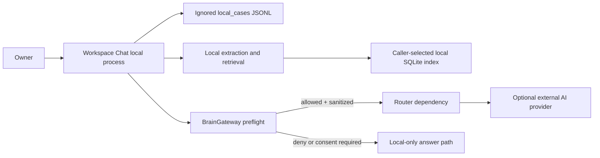

# Threat Model

Status: `ACTIVE`
Owner role: Project owner with security reviewer
Last reviewed: 2026-07-25
Review cadence: Before external-provider, parser, storage or dependency changes

## Scope and method

This model covers the current local-first Workspace Chat, RAG v2 foundations and
optional provider routing. It uses a lightweight STRIDE-style assessment. A
listed mitigation is marked only as far as code/tests currently prove it.

## Assets

| Asset | Primary protection need |
|---|---|
| Local sources, chat content and evidence | Confidentiality, owner control |
| Workspace Chat JSONL state under `local_cases/` | Confidentiality, integrity, recoverability |
| RAG v2 local index and chunks | Confidentiality, integrity, rebuildability |
| API keys and provider configuration | Confidentiality |
| Source privacy labels and owner consent | Integrity, correct authorization |
| Tracked code, docs and dependency configuration | Integrity, provenance |
| Logs, test output and diagnostics | Confidentiality, minimum necessary detail |

## Trust boundaries

The provider boundary is optional. `local_only` and `confidential` sources are
hard-denied by the gateway; `unknown` and `machine_only` need valid consent
bound to source set, destination and purpose. This is verified in
`src/aios_habit/brain_gateway.py` and its router-mock tests.

## Threat register

| ID | Threat / STRIDE | Current control | Status | Residual risk / next action |
|---|---|---|---|---|
| TM-01 | Private text or path sent to a provider (I) | Real Workspace Chat route blocks `local_only`/`confidential`/`unknown`, requires consent and locks the enabled source set; Gateway route adds default-deny, source-set/destination/purpose consent and sanitization | `PARTIAL` | Real router-enabled path currently has a separate guard and does not prove Gateway sanitization/preflight is its single enforcement point; complete P0 consolidation gate before external-release claim. |
| TM-02 | Credential leaked to source, logs or Git (I) | `.gitignore` patterns, audit secret scan and safe test fixtures | `PARTIAL` | Pattern detection is heuristic; owner must use private reporting and revocation procedure. |
| TM-03 | Prompt injection in uploaded document changes behavior (T/E) | Source selection, privacy labels and evidence discipline | `PARTIAL` | No dedicated untrusted-content isolation policy/runtime guard is proven; add regression cases when synthesis expands. |
| TM-04 | Malicious/oversized document crashes extraction (D/T) | Extractors return owner-facing failures in current flows | `PARTIAL` | File-size/resource quotas and sandboxing are not proven; document operational limits before broader release. |
| TM-05 | Local index or JSONL corruption/loss (T/D) | Local storage; SQLite schema creation; manual rebuild possible for caller-managed RAG index | `PARTIAL` | Backup/restore is owner-operated; restore drill required. |
| TM-06 | Unauthorized cloud route through incorrect label/consent (E) | Strictest privacy rule, default deny, source-set hash and consent expiry validation | `IMPLEMENTED` | Correct label selection remains an owner responsibility. |
| TM-07 | Compromised dependency or drifted Git tag (T) | Router pinned to `v0.4.0`; manual upgrade validation recorded | `PARTIAL` | SBOM, advisory triage and reproducibility policy are documented; automated enforcement is pending owner choice. |
| TM-08 | Provider outage, quota or bad response (D/I) | Safe Vietnamese failure messages in Workspace Chat adapter; local-first paths remain available | `PARTIAL` | No availability SLA or provider health guarantee. |
| TM-09 | Sensitive diagnostic/report content exported (I) | Git-ignore rules and audit/export controls | `PARTIAL` | Operators need follow the safe diagnostic procedure. |
| TM-10 | Single maintainer cannot respond/recover (D) | Handover and documentation baseline | `PARTIAL` | Assign named backup owner through governance decision. |

Legend: S=spoofing, T=tampering, R=repudiation, I=information disclosure,
D=denial of service, E=elevation of privilege.

## Security acceptance evidence

- Full test suite, CLI audit and Workspace Chat import are mandatory project
  gates; see [quality gates](../quality/QUALITY_GATES.md).
- Router/mock privacy tests demonstrate deny/consent/sanitization behavior; Workspace
  Chat provider tests demonstrate blocked labels and source-set consent checks.
- No live credential is needed for CI. Live smoke is manual, explicit, generic
  and must not log keys or source content.
- Residual risks TM-01, TM-03, TM-04, TM-05, TM-07 and TM-10 require owner
  review before claiming production/compliance readiness.
- TM-01 is a P0 runtime follow-up tracked in
  [AI-GW-REAL-ROUTE-POLICY-CONSOLIDATION](../roadmap/backlog/AI-GW-REAL-ROUTE-POLICY-CONSOLIDATION.md).
