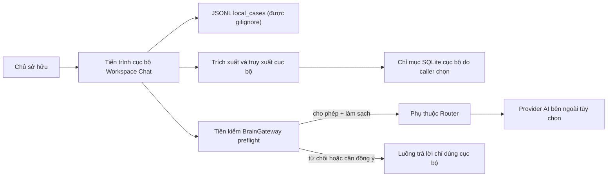

# Mô Hình Mối Đe Dọa (Threat Model)

Status: `ACTIVE`
Owner role: Project owner with security reviewer
Last reviewed: 2026-07-25
Review cadence: Before external-provider, parser, storage or dependency changes

## Phạm Vi và Phương Pháp (Scope and Method)

Mô hình này bao quát nền tảng Workspace Chat ưu tiên cục bộ (local-first) hiện tại, nền tảng RAG v2 và tuyến định tuyến provider tùy chọn. Nó sử dụng phương pháp đánh giá theo mô hình STRIDE gọn nhẹ. Một biện pháp giảm thiểu chỉ được đánh dấu là đã có nếu mã nguồn/kiểm thử hiện tại chứng minh được điều đó.

## Tài Sản Cần Bảo Vệ (Assets)

| Tài sản | Nhu cầu bảo vệ chính |
|---|---|
| Nguồn dữ liệu cục bộ, nội dung chat và bằng chứng | Tính bảo mật (Confidentiality), quyền kiểm soát của chủ sở hữu |
| Trạng thái JSONL của Workspace Chat dưới `local_cases/` | Tính bảo mật, tính toàn vẹn (Integrity), khả năng phục hồi |
| Chỉ mục và các chunk cục bộ của RAG v2 | Tính bảo mật, tính toàn vẹn, khả năng tái tạo |
| API key và cấu hình provider | Tính bảo mật |
| Nhãn bảo mật nguồn và sự đồng ý của chủ sở hữu | Tính toàn vẹn, ủy quyền chính xác |
| Mã nguồn, tài liệu và cấu hình phụ thuộc được theo dõi | Tính toàn vẹn, nguồn gốc xuất xứ (Provenance) |
| Log, kết quả kiểm thử và dữ liệu chẩn đoán | Tính bảo mật, mức chi tiết tối thiểu cần thiết |

## Ranh Giới Tin Cậy (Trust Boundaries)

Ranh giới provider là tùy chọn. Các nguồn `local_only` và `confidential` bị Gateway từ chối cứng; `unknown` và `machine_only` cần sự đồng ý hợp lệ ràng buộc với tập nguồn, đích đến và mục đích. Điều này đã được kiểm chứng trong `src/aios_habit/brain_gateway.py` và các bài test mock router.

## Sổ Đăng Ký Mối Đe Dọa (Threat Register)

| ID | Mối đe dọa / STRIDE | Chốt chặn kiểm soát hiện tại | Trạng thái | Rủi ro tồn dư / Hành động tiếp theo |
|---|---|---|---|---|
| TM-01 | Văn bản riêng tư hoặc đường dẫn bị gửi tới provider (I) | Tuyến Workspace Chat thực tế và mock đều dùng `BrainGateway` trước khi gọi adapter; ảnh chụp nhanh toàn bộ nguồn, ràng buộc sự đồng ý, cấp phép bằng chứng gửi ra ngoài và payload định kiểu đã làm sạch đều được bao phủ bởi kiểm thử hồi quy | `IMPLEMENTED` | Việc lựa chọn nhãn của chủ sở hữu và điều khoản provider bên ngoài vẫn là rủi ro tồn dư; các nhãn nhạy cảm cũ không thể gửi cho đến khi được phân loại lại tường minh. |
| TM-02 | Thông tin xác thực bị lộ vào mã nguồn, log hoặc Git (I) | Các mẫu `.gitignore`, quét secret khi audit và fixture kiểm thử an toàn | `PARTIAL` | Phát hiện theo mẫu mang tính heuristic; chủ sở hữu phải sử dụng quy trình báo cáo riêng tư và thu hồi key. |
| TM-03 | Prompt injection trong tài liệu tải lên làm thay đổi hành vi hệ thống (T/E) | Lựa chọn nguồn, nhãn bảo mật và kỷ luật bằng chứng | `PARTIAL` | Chưa có chính sách/chốt chặn runtime cô lập nội dung không đáng tin cậy chuyên dụng; bổ sung bài test hồi quy khi mở rộng tổng hợp. |
| TM-04 | Tài liệu độc hại / quá kích thước làm sập bộ trích xuất (D/T) | Bộ trích xuất trả về lỗi an toàn cho chủ sở hữu trong luồng hiện tại | `PARTIAL` | Chưa có hạn ngạch kích thước tệp / tài nguyên và sandbox; cần tài liệu hóa giới hạn vận hành trước khi phát hành rộng hơn. |
| TM-05 | Hỏng / mất chỉ mục cục bộ hoặc JSONL (T/D) | Lưu trữ cục bộ; tạo schema SQLite; có thể tái tạo thủ công cho chỉ mục RAG do caller quản lý | `PARTIAL` | Sao lưu/khôi phục do chủ sở hữu tự vận hành; yêu cầu diễn tập khôi phục. |
| TM-06 | Tuyến đám mây trái phép do nhãn/đồng ý không chính xác (E) | Quy tắc bảo mật nghiêm ngặt nhất, từ chối mặc định, mã băm tập nguồn và kiểm tra hết hạn sự đồng ý | `IMPLEMENTED` | Việc lựa chọn nhãn chính xác vẫn là trách nhiệm của chủ sở hữu. |
| TM-07 | Phụ thuộc bị xâm nhập hoặc Git tag bị trôi lệch (T) | Router được ghim vào `nakazasen-ai-router@v0.8.0`; kiểm chứng nâng cấp thủ công được ghi nhận | `PARTIAL` | Chính sách SBOM, xử lý cảnh báo và tính tái tạo đã được ghi nhận; thực thi tự động đang chờ quyết định của chủ sở hữu. |
| TM-08 | Provider ngừng hoạt động, hết hạn ngạch hoặc phản hồi xấu (D/I) | Thông báo lỗi an toàn bằng Tiếng Việt trong adapter Workspace Chat; tuyến ưu tiên cục bộ luôn sẵn sàng | `PARTIAL` | Không có cam kết SLA về tính khả dụng hoặc bảo đảm sức khỏe provider. |
| TM-09 | Nội dung chẩn đoán / báo cáo nhạy cảm bị xuất ra ngoài (I) | Quy tắc Git-ignore và kiểm soát audit/export | `PARTIAL` | Người vận hành cần tuân thủ quy trình chẩn đoán an toàn. |
| TM-10 | Một Maintainer duy nhất không thể phản ứng / khôi phục (D) | Tài liệu bàn giao (Handover) và tài liệu cơ sở | `PARTIAL` | Chỉ định chủ sở hữu dự phòng thông qua quyết định quản trị. |

Chú giải STRIDE: S=giả mạo (spoofing), T=giả mạo sửa đổi (tampering), R=chối bỏ (repudiation), I=tiết lộ thông tin (information disclosure), D=từ chối dịch vụ (denial of service), E=leo thang đặc quyền (elevation of privilege).

## Bằng Chứng Nghiệm Thu Bảo Mật (Security Acceptance Evidence)

- Toàn bộ bộ test, CLI audit và import Workspace Chat là các cổng dự án bắt buộc; xem [cổng chất lượng (Quality gates)](../quality/QUALITY_GATES.md).
- Các bài kiểm thử quyền riêng tư router/mock và kiểm thử provider Workspace Chat thực tế chứng minh hợp đồng Gateway duy nhất: từ chối cứng, đồng ý theo tập nguồn, cấp phép bằng chứng gửi ra ngoài, ranh giới payload định kiểu và làm sạch đường dẫn/key.
- Không cần thông tin xác thực live cho CI. Live smoke là thủ công, tường minh, generic và tuyệt đối không ghi log key hoặc nội dung nguồn.
- Các rủi ro tồn dư TM-03, TM-04, TM-05, TM-07 và TM-10 cần sự đánh giá của chủ sở hữu trước khi tuyên bố sẵn sàng cho production/tuân thủ.

